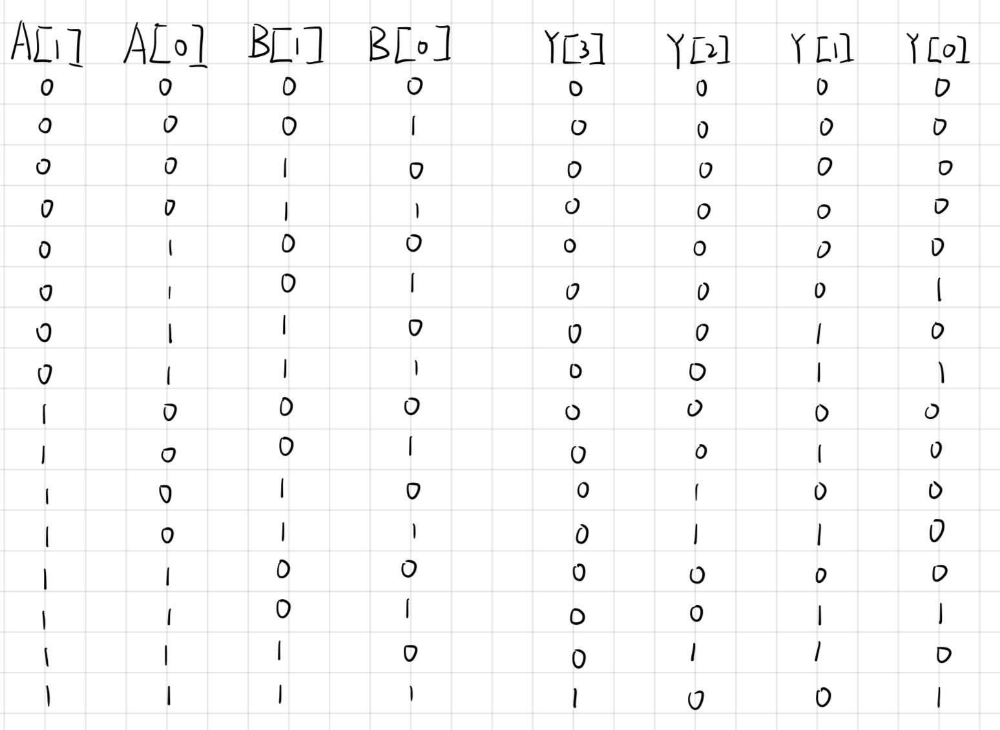

# Homework 2
## **PB22111711 陈昕琪**
***
## T1
***
由A=0，B=0，C=1，Y=1，可判断此时下半部分不能导通，且上半部分导通。
由A=1，B=1，C=0，Y=1，可判断此时上半部分导通，且下半部分不能导通。
因此得出的结果如下

补全的表格如下

## T2
***
根据逻辑表达式运算规则及与非门定义可知

首先，用与非门可以表示出非门，而后，用与非门和非门可以表示出与门，还可以用与非门，与门，非门表示出或门。
与门，非门，或门都具有逻辑完备性，因此与非门（NAND）也具有逻辑完备性。

## T3
***
由加法器定义得出S和C对应的ABC的同值和真值表如下

连接出的电路图如下：

## T4
***
1. A可取的最大值为3，二进制表示为11
2. B可取的最大值为3，二进制表示为11
3. Y可取的最大值为3×3，为9，二进制表示为1001
4. Y最大值为9，需要四位二进制来表示
5. 真值表如下

6. 根据真值表，写出Y[2]的表达式如下

## T5
***
根据真值表以及逻辑表达式，用NAND表示出的XOR的逻辑表达式如下

## T6
***
根据题意，得出的真值表，Y的表达式,画出的电路图如下

## T7
***
逻辑分析：
1. 每个状态的判断都可以从m,a,d,Other四种情况判断。
    对于第一个状态（init）,直到判断出是m才能开始检测
    对于第二个状态，有两种情况，为a则继续向后判断，其他情况则返回第一个状态
    对于第三个状态，有三种情况，为m则返回第二种状态判断下一个是否为a，为d则继续向后判断，其他情况返回init
    对于第四种状态，有三种情况，为m则返回第二种情况判断下一个是否为a，为a则继续向后判断，其他情况则返回init
    对于第五种状态，有三种情况，为m则返回第二种情况判断下一个是否为a，为m则继续向后判断，其他情况则返回init
    对于第六种状态，有三种情况，为m则返回第二种状态判断下一个是否为a，为a则返回第三种情况，其他情况则返回init
补全的状态图如下

2. 至少需要四个锁存器，表示四种时序状态来组成此有限状态机

## T8
***
1. 内存最多可以寻址的地址空间是2的b次方个地址。因此，最多可以寻址的地址空间大小是2的b次方。
2. 内存最多可以存储2的a次方位的数据。由于每个地址可以存储一位数据，所以最多可以存储的数据位数是2的a次方。

## T9
***
1. A[1]=0,A[0]=0,WE=1,这样才能读入数据
2. 要想增加寻址能力，应当
    增加地址线为k条，将D列增加到k列。
    内存容量应该增加到2的k次方个位，以支持更大的地址空间。
    修改电路逻辑并将数据正确地路由到所需的内存位置。

## T10
***
1. occupation ratio需要7位，score需要2位，time remaining需要2+6=8位，skill charge ratio需要7位，共需要24位
2. 每个记牌器的四行有四个逻辑电路，则需要16位来储存记牌器的状态
3. 以单独逻辑电路存储每个元素的方法可能更好。这是因为这种方法可以使得每个元素的值独立地进行修改和更新，而不会影响其他元素。此外，它还可以减少存储所需的总位数。然而，这种方法可能需要更多的硬件资源来实现四个独立的逻辑电路。如果硬件资源有限，以及对于整个记分牌状态的同时更新不是必需的，那么将整个记分牌状态存储在一起可能是更合适的选择。

   
