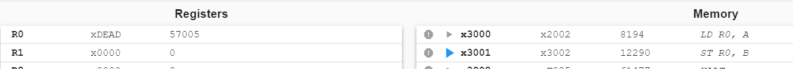
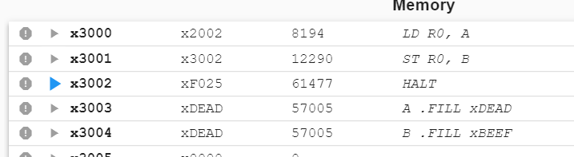
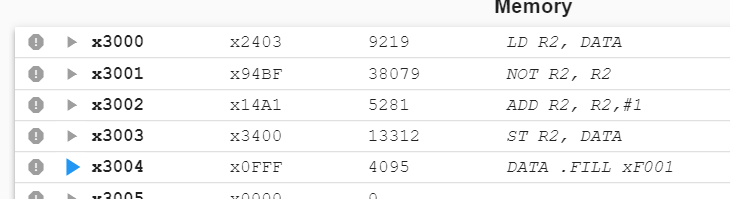
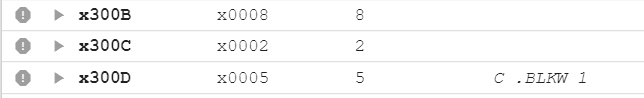
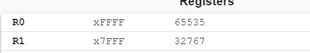

# Homework 5
## **PB22111711 陈昕琪**
## T1
​	`.END`伪操作是告诉汇编器“程序结束了”，出现在`.END`之后的任何字都会被汇编器丢弃，但是并不不会停止程序的执行，只表示一个分隔符，表示源程序结束了。
而`HALT`指令则是直接停止程序的执行。与伪操作不同，汇编器翻译完指令后，会进行操作。

## T2
​	队列是一种存储数据的数据结构，是一种操作受限的线性表，队列只允许在表的一端进行插入，在表的另一端进行删除。可进行插入的一段称为队尾，可进行删除的一端称为队头。队列的主要特点就是先进先出。依照存储结构可分为：顺序队和链式队。
## T3
​	若将`A .FILL xDEAD`和`B .FILL xBEEF`指令放在`HALT`指令之前，程序会执行内存存储的指令，如`A`语句的操作码为`1101`，为保留的操作码，所以会出错。同理`B`指令也会出错，因此将`A,B`指令都移动到`HALT`之后。
因此修改后的指令应该如下：

```lc3
.ORIG x3000 
LD R0, A
ST R0, B
HALT
A .FILL xDEAD
B .FILL xBEEF
.END
```
​	运行后的结果为：



​	运行完第一步，将A地址存储的内容写进`R0`



​	运行完第二步，将`R0`中存储的内容写进`B`地址。
## T4
没有问题，每个模块有自己的`LABLE`表，在没有` .EXTERNAL` 声明的前提下，只会从自己的` LABLE` 表中查找对应标签的地址，所以两个模块运行时不会有冲突。
## T5
1. `xF001`翻译为二进制是`1111_0000_0000_0001`,那么其二进制补码应该为`0000_1111_1111_1111`,翻译为十六进制即`x0FFF`。
2. 会将计算出的补码返回`DATA`



3. 由于程序没有`HALT`语句，因此执行完`ST R2， DATA`语句之后,会将`DATA`语句当作指令继续执行。此时`DATA`语句表示无条件跳转，不断执行`DATA`语句，因此程序不会停止，一直运行`DATA`语句。
4. 开放题：没有将`HALT`语句写在程序里，避免这种情况发生应当在编写程序时将`HALT`语句放置在正确的位置，并将`.FILL`等伪操作放置在`HALT`语句之后，避免被当作指令执行。
## T6
`.FILL`是告诉编译器要占用一个地址，并填充初始值。
`.BLKW`是告诉编译器在程序空间内，开始占用一连串的地址空间（可以用来存储字符串或者一串数字）。适用于操作数不确定的情况，
`.STRINGZ`是告诉编译器连续占用并初始化`n+1`个内存内容，其操作数是双括号引起来的`n`个字符。其`n+1`个内存单元包含字符串对应的字符的`ASCII`值的零拓展值，而内存的最后一个字被初始化为`0`，通常用于识别字符串是否结束。

## T7
​	需要将`R0，R1`的值不断减小，直到`R0`的值等于`R1`。所以补全的程序如下：
```dotnetcli
.ORIG x3000
LD R0, A
LD R1, B
X NOT R2, R0
ADD R2, R2, #1
ADD R2, R2, R1
BRz DONE
ADD R1, R1, #1
ADD R0, R0, #-1
BRnzp X
DONE ST R1,C
TRAP x25
A .BLKW 1
B .BLKW 1
C .BLKW 1
.END
```
​	最后运行出的结果如图（以`8`和`2`为例）



**这里`A`位置需要放置较大的数，`B`位置需要放置较小的数**

## T8
​	题目要求实现`R0`寄存器中的值右移一位，所以程序补全如下
```dotnetcli
.ORIG x3000
; Suppose R0 is already loaded with the target number
; Initialize
AND R1, R1, #0 ; R1<-0
ADD R2, R1, #15 ; R2<-1111
ADD R3, R1, #2; 1 << (**DELETED**)
ADD R4, R1, #1 ; 1 << (15 - i),R4<-1
AND R5, R5, #0 ; Temp result
; Main Loop
L AND R5, R3, R0 ; Test bit
BRz N; **DELETED**
ADD R1, R1, R4 ; Add to result
N ADD R3, R3, R3 ; **DELETED**
ADD R4, R4, R4 ; L-shift R4
ADD R2, R2, #-1 ; **DELETED**
BRp L
; End
HALT 
.END
```
(a)2
(b)z
(c)R3,R3
(d)R2,R2,#-1
测试运行结果如下(数据存储在`R0`中，右移后的数字存储在`R1`中)



## T9
每一步之后栈内存储的数据如下：（栈底在左侧，栈顶在右侧）
```dotnetcli
PUSH A;A
PUSH B;AB
POP;A
PUSH C;AC
POP;A
PUSH D;AD
PUSH E;ADE
PUSH F;ADEF
POP;ADE
PUSH G;ADEG
POP;ADE
POP;AD
POP;A
PUSH H;AH
```
1. A和H
2. 在`PUSH F`和`PUSH G`语句
3. 对于队列，每步进行完队列中的元素如下（左为队列头）
```dotnetcli
ENQUEUE I;HAI
DEQUEUE;AI
ENQUEUE J;AIJ
ENQUEUE K;AIJK
DEQUEUE;IJK
ENQUEUE L;IJKL
DEQUEUE;JKL
DEQUEUE;KL
DEQUEUE;L
DEQUEUE;empty
ENQUEUE M;M
DEQUEUE;empty
```
## T10
题目说明栈顶指针存放在`R6`，将返回值存储在`R0`中。
函数实现如下：

```dotnetcli
PEEK
ST R1, SAVE_R1
ST R2,SAVE_R2;将寄存器中的内容写进内存
LD R1,EMPTY；R1 <- xC000=-x4000
ADD R2, R6, R1;与栈顶指针作比较
BRz UNDERFLOW；相等说明下溢
LDR R0, R6, #0;取栈顶元素
LD R2, SAVE_R2
LD R1, SAVE_R1;恢复寄存器中的内容
RET；返回

UNDERFLOW
LEA R0, UNDERFLOW_MSG;输出下溢
PUTS
HALT

EMPTY .FILL xC000
SAVE_R1 .BLKW #1
SAVE_R2 .BLKW #1
UNDERFLOW_MSG .STRINGZ "Stack underflow error"
```