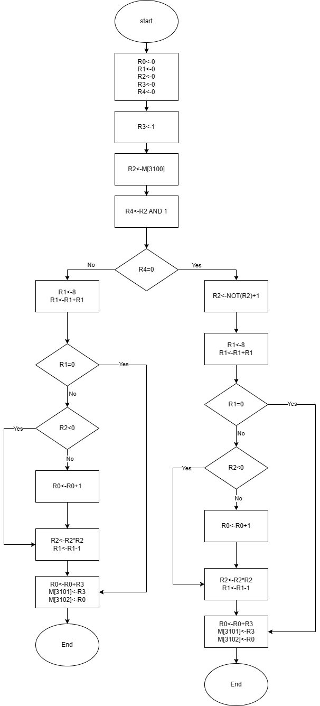

# Lab 1 report

**PB22111711 陈昕琪**


## 实验目的与内容

编写一个LC-3机器语言的程序满足要求
1. 给定n，如果n是奇数，计算n的二进制表示中有多少0
2. 如果n为偶数，计算n的负值的二进制补码中有多少0

## 逻辑设计

1. 程序主体思路：
   首先，初始化寄存器(清零)，将n与1做按位与运算并分别跳转到相应的奇数和偶数的循环，并进行计数。
   对于循环，在寄存器中存入循环次数并在每次循环结束后减一直到减到零为止。
   对于计算零的个数，每次左移一位，通过判断左移后的数字的正负来判断最高位(当前符号位)是1还是0,相应的跳转到对应语句。
2. 程序的流程图如下：
<div align=center>

</div>

## 程序代码分析

1. 首先设置初始位置，对各寄存器数据清零处理
```
0011 0000 0000 0000;初始位置，PC=x3000
0101 000 000 1 00000;R0清零，用来储存0的个数 x3000
0101 001 001 1 00000;R1清零，用来储存循环的次数 x3001
0101 010 010 1 00000;R2清零，用来储存数字n x3002
0101 011 011 1 00000;R3清零，用来储存学号 x3003
0101 100 100 1 00000;R4用于判断奇偶 x3004
0001 011 011 1 00001;我的学号为PB22111711，最后一位是1,将学号存入R3中 x3005
0010 010 011111001;R2<-M[x3100] x3006
```
2. 然后，通过AND指令判断输入的数字的奇偶性，并进行相应的跳转
```dotnetcli
0101 100 010 1 00001;R4<-(AND R2,1)判断奇偶性 x3007
0000 010 000001101;若为0为偶数则跳转x3016   x3008
```
3. 要计算零的个数，需要不断左移，判断最高位，所以设置一个循环数16，并存进寄存器中，每次循环结束减一，直到最后为0，循环结束。每次循环都判断最高位，不断左移，最终可以计算出0的个数。并进行相应的赋值
```dotnetcli
0001 001 001 1 01000;R1赋为8 x3009
0001 001 001 0 00001;R1<-R1+R1,R1赋值为16 x300A
0000 010 000000110;若R1为0则循环结束跳转到x3012  x300B
0001 010 010 1 00000;R2<-R2+0 x300C
0000 100 000000001;若R2小于0则最高位为1跳转x300F x300D
0001 000 000 1 00001;最高位为0,R0<-R0+1 x300E
0001 010 010 0 00010;R2<-R2*2 x300F
0001 001 001 1 11111;R1<-R1-1 x3010
0000 111 111111001;跳转回x300B判断 x3011
0001 000 000 0 00011;循环结束，加学号R0<-R0+R3 x3012
0011 011 011101101;M[x3101]<-R3 x3013
0011 000 011101101;M[x3102]<-R0 x3014
1111 0000 00011001;结束程序 x3015
```
4. 对于偶数要先取反再加一得到二进制补码(如果输入的数是负数进行的也是同样的操作)。之后进行与奇数同样的循环操作和赋值操作。
```dotnetcli
1001 010 010 111111;偶数先取反 x3016
0001 010 010 1 00001;R2<-NOT(R2)+1 x3017
0001 001 001 1 01000;R1赋为8 x3018
0001 001 001 0 00001;R1<-R1+R1,R1赋值为16 x3019
0000 010 000000110;若R1为0则循环结束跳转到x3021  x301A
0001 010 010 1 00000;R2<-R2+0 x301B
0000 100 000000001;若R2小于0则最高位为1跳转x301E x301C
0001 000 000 1 00001;最高位为0,R0<-R0+1 x301D
0001 010 010 0 00010;R2<-R2*2 x301E
0001 001 001 1 11111;R1<-R1-1 x301F
0000 111 111111001;跳转回x301A判断 x3020
0001 000 000 0 00011;循环结束，加学号R0<-R0+R3 x3021
0011 011 011011110;M[x3101]<-R3 x3022
0011 000 011011110;M[x3102]<-R0 x3023
1111 0000 00011001;结束程序 x3024
```

## 测试结果与分析

|n|odd or even|Binary code|2's complement code|The number of 0|The final result|
|---|---|---|---|---|---|
|5|odd|0000_0000_0000_0101|-|14|14+1=15|
|100|even|0000_0000_0110_0100|1111_1111_1001_1100|4|4+1=5|
|-5|odd|1111_1111_1111_1011|-|1|1+1=2|
|-100|even|1111_1111_1001_1100|0000_0000_0110_0100|13|13+1=14|
|0|even|0000_0000_0000_0000|-|16|16+1=17|

测试结果图如下:
---
n=5


---
n=100


---
n=-5


---
n=-100


---
n=0


---
由此可见程序正确。

## 总结与反思
1. 本次实验，通过编写lc3程序，初步了解了lc3语言，并巩固了课程中学习的lc3指令以及操作的运用。
2. 对于ADD，AND，LD，ST，条件跳转语句有了更深入的了解。
3. 本次实验程序编写仍有可改进的地方，比如偶数奇数循环流程一样，灵活运用条件跳转语句可节省内存空间，优化程序
4. 在debug过程中，发现经常出错的位置往往是条件跳转或者带有PC偏移量的语句，通过本次实验，对于各语句的运用方法有更深入的了解，并且可以熟练运用计算PC偏移量实现简单程序。
5. 在今后的实验中要注意，PC偏移量的正确计算，以及编写程序前理清逻辑思路，有助于更好更快的编写程序。
