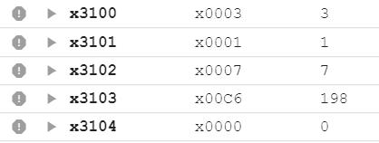

# Lab 2 report

**PB22111711 陈昕琪**


## 实验目的与内容

编写一个LC-3机器语言的程序满足要求：
给定一个序列，$f(n)={(v_n,d_n)|v_n\in Z,d_n\in {+,-},n>1}$
对应的python代码为
```py
def calculate_next_term(v_n: int, d_n: bool):    
    if d_n:   
        v_next = 2 * v_n + 2    
    else:        
        v_next = 2 * v_n - 2         
    if v_next % 8 == 0 or last_digit(v_next) == 8:       
         d_next = not d_n    
    else:        
        d_next = d_n         
    return v_next, d_next
```
要求根据N的值，输出f(N)。

## 逻辑设计

1. 程序主体思路：
   对于求序列的问题，需要进行条件判断，对于不同的条件进行不同的运算。对于d，需要判断是否是8的倍数，和最后一位是不是8，并根据得到的d的值，对v进行运算。同时，需要设置合理的循环，来判断程序是否结束。对于程序的详细解释在程序代码分析会有详细解释。
2. 程序的流程图如下：（用平板画的，有点粗糙qwq）
<div align=center>

</div>

## 程序代码分析

1. 首先设置初始位置，将想要处理的数据放在相应的寄存器中。这里我使用的是将$v_1$和$d_1$存在内存中，虽然题目未作要求，但是这样程序可更改性更强。（但是debug的时候还是先直接赋值了，一遍一遍打太麻烦了）
```
.ORIG x3000
LD R1, xFF        ;v_1存在x3100中
LD R2, xFF        ;d_1存在x3101中
LD R3, xFF        ;N存在x3102中
```
2. 然后，通过$v_n$的值判断$d_n$的正负，这里加号用1表示，减号用0表示。本题中需要判断的是是否是8的倍数，以及最后一位数是不是8.
> 1. 对于8的倍数，因为8是2的3次方，所以只需要和7（二进制表示为111）进行按位与，并判断结果是否为0即可。

> 2. 判断最后一位是不是8，需要对10取模。但是我没有想到更好的更快的取模运算的方法。所以用了很原始的方法，不断地减10，直到得到的数字小于或者等于零，再把它和-2，相加，判断是否为0。因为如果最后一位是8，那么不断减10后会得到-2，如果不是-2，那么不满足条件。

> 3. 由于两个条件是或的关系，所以先判断是不是8的倍数，判断是后直接跳转到更改d的符号。如果不是，则继续判断最后一位数字是不是8，如果不是，则不更改d的值，直接跳转到计算的部分。

> **这里计算的是根据v_next得出的d_next的值，所以要将N进行-1操作，以便判断程序什么时候结束。** 
```dotnetcli
check_digit
ADD R3, R3, #-1   ;R3<-R3-1
AND R4, R1, #7    ;取模运算
BRz up_date_d     ;如果为0则说明是八的倍数，更新d
ADD R5, R1, #0    ;
continue
ADD R5, R5, #-10  ;
BRp continue      ;
ADD R5, R5, #2    ;
BRz up_date_d     ;跳转到更新d
BRnzp caculate    ;跳转到运算
```
3. 对于更新d的值，首先要判断它是0还是1，取反是不行的（第一次写的时候直接取反了，debug才看出来不对）。因此，使用跳转语句，分别操作。变为0，则按位与0，变为1则加1，即可得到d更新后的值。
```dotnetcli
up_date_d
ADD R2, R2, #0    ;
BRp turn_0        ;
BRz turn_1        ;
turn_0
AND R2, R2, #0    ;
BRnzp caculate    ;
turn_1
ADD R2, R2, #1    ;
```
4. 运算时，首先要判断N是否为0，若为0则跳转到最后的步骤，将结果储存在内存中。在这里，我先判断$d_n$是加号还是减号，若为加号则直接跳转到加法区域运算。若为减法则进行减法运算。之后再跳转回判断d的模块，进行判断。
```dotnetcli
caculate
ADD R3, R3, #0    ;判断N是不是0
BRz final_result  ;
ADD R2, R2, #0    ;
BRp add_result    ;大于零则是加2
ADD R1, R1, R1    ;R1<-R1+R1
ADD R1, R1, #-2   ;减2
BRnzp check_digit;

add_result
ADD R1, R1, R1    ;R1<-R1+R1
ADD R1, R1, #2    ;R1<-R1+2
BRnzp check_digit   ;
```

5. 最后，将相应的值储存在地址中。这里我将$d_n和$v_n$的值都储存在相应的位置中，更方便debug。最后结束程序。
```dotnetcli
final_result
ST R1, xE6        ;
ST R2, xE6        ;

TRAP x25          ;
.END
```


## 测试结果与分析

|N|f(N)|d_N|
|---|---|---|
|1|3|1|
|2|8|0|
|3|14|0|
|4|26|0|
|5|50|0|
|6|98|1|
|7|198|0|
|8|394|0|
|9|786|0|

测试结果图如下:
---
N=1


---
N=2


---
N=3


---
N=4


---
N=5


---
N=6


---
N=7


---
N=8


---
N=9


---
由此可见程序正确。

## 遇到的问题及反思
在编写程序时，遇到了很多问题。有关于取模怎么判断，关于跳转怎么设计更合理等比较整体化的大模块问题。也在debug中遇到很多细细碎碎的小问题。最后都逐一解决，只是有的问题还需要时间来优化一下。下面简单说一下遇到的问题中，比较典型有代表性的。
1. 首先是根据v判断d的时候，有两个条件。
> 判断是不是8的倍数,因为8的特殊性，这里可以直接按位与得出结果，但是如果是不具有特殊性的数字，则可能需要原始的不断减的方式。这里还没有想到很好的解决办法。

> 判断最后一位是不是8，由于在计算机中，数字是以二进制补码形式存储的，所以不能像人脑那样转化成十进制之后判断，也不能像高级汇编语言那样直接判断。所以这里用的是上面提到的方法，也许有更好的方法，但是我没有找到。

2. 然后就是对于d的更新，第一次写的时候，直接取反了，debug的时候才发现不对劲。忘记了数字是16位的，如果d是0，取反之后应该是-1，所以又专门写了对于d的跳转语句，类似C里面的if-else。
3. 再者是有关R1的运算。因为BR语句条件判断不满足之后，会直接运行吓=下一条语句。所以第一次写的时候想利用这个特性，将加法减法的语句合在一起写。因为加法减法数值上只差了4。但是最初写的版本里，先将R1-2,再将R1左移了，导致结果错误。之后为了逻辑清楚，还是将两个语句分开写了，这样程序可读性比较好。
4. 其他的还有一些细小的问题，由于这次写的是机器码，可以直接根据label定义跳转的位置，所以在地址的计算上没有出现过多问题。在写完程序debug的过程中对于一些小问题，根据语句和条件分析，很快就解决，在这里不多赘述。
5. **v和v_next还有d和d_next的顺序还有求得方式要搞清楚，要不然写程序会很混乱，而且容易出错。**

## 有关循环语句的优化
在程序中，想要优化循环语句，可以尝试以下方法。
1. 优化条件判断：BR语句是根据NZP来判断是否跳转，可以将想要判断的值在BR语句上一条计算，免去了R0<-R0+0这种语句，使程序更加简洁。以及在判断时要将三个条件都考虑到，避免出现漏掉条件的问题。
2. 减少不必要的跳转指令：在程序设计之初，可以减少冗余的程序跳转指令。根据BR语句判断不符合条件码之后，还会继续执行下一条语句的特性，可以合并跳转和不跳转后的相同的代码或者步骤，使程序更加简洁。
3. 使用位运算替代加减运算：在一些地方可以使用位运算来替代加减运算，位运算通常比加减法的效率更高。


## 总结
1. 本次实验，通过编写lc3程序，深入了解了lc3语言，并巩固了课程中学习的lc3指令以及操作的运用。学会根据题目，统筹规划几个大的程序板块，并在每个大的程序板块中实现各自的功能，这是一种模块化思想。
2. 对于ADD，AND，条件跳转语句有了更深入的了解。并且学会使用机器码，更加有效方便地编写程序。能够根据简单的位运算和条件判断实现较为复杂的程序。
3. 本次实验程序编写仍有可改进的地方，比如可以优化循环体系等。
4. 在debug过程中，对于一些细碎的小问题，能够快速解决。感受到程序整体设计思绪规划清楚后再写程序会方便很多，对于程序的整体把控也更加轻松。
5. 在今后的实验中要注意程序完整性，运用模块化思想，学会优化程序。对于一些小问题不要再犯。
