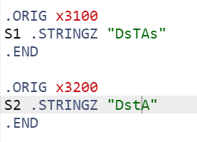
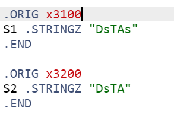
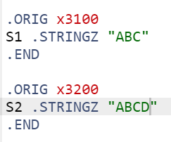
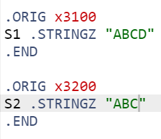
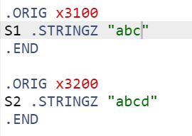
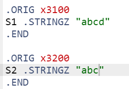

# Lab 4 report

**PB22111711 陈昕琪**


## 实验目的与内容

编写一个lc3程序，运用递归算法是是实现`n - 环`问题的解决。
具体要求：
根据存储在`x3100`处的n的值，在x3101及其后面的地址输出`n - 环`问题的解决过程，

## 逻辑设计

程序所用的递归函数：
解决九连环问题，需要递归调用函数
对于REMOVE:
   $$R(0) = nothing to do$$
   $$R(1) = remove the 1^{st} ring$$
   $$R(i) = R(i-2) + remove thr i^{st} ring + P(i-2) + R(i-1),(i >= 2)$$
   **（PUT和REMOVE是互逆的函数）**
对于PUT:
   $$P(0) = nothing to do$$
   $$P(1) = put the 1^{st} ring$$
   $$P(i) = P(i-1) +  R(i-2) + put the i^{st} ring + P(i-2),(i >= 2)$$

## 程序代码分析

1. 首先将各寄存器清空，便于之后处理数据
由于这里需要用到递归算法，因此需要用到R6作为栈指针，用来存储指令的位置，同时用R7来实现指令的跳转。
同时，要将n的值存进R0,并存放地址值和指针值。
R7则存放HALT(栈底，用于判断程序结束)
```
    .ORIG x3000;初始化
    AND R0, R0, #0;用来存储n的值
    AND R1, R1, #0;用来输出操作
    AND R2, R2, #0;用来存放地址值
    AND R3, R3, #0;用来计数
    AND R4, R4, #0;用来操作
    AND R6, R6, #0;n用于移位时计数
    AND R7, R7, #0;
        
    LDI R0, N_value;将n的值存入R0
    LD R2, N_value;存放地址值
    LD R6, Begin;存放指针
    LD R7, EXIT;存放地址
```
2. REMOVE函数
+ 进入REMOVE函数，首先要将栈顶元素更新，方便下次调用。
+ 根据REMOVE函数的定义，首先判断是否为基础值——0或1。相应跳转到对应语句。若不为初始值，则进行R(i-2)的操作，即递归调用函数。
+ 然后进行$remove thr i^{st} ring$操作，而此操作反映到结果上是将结果的第i位由0变为1，相当于加$2^{i-1}$，因此加入R3和R4用于处理R1语句。
+ 进行P(i-2)操作，只需将R0的值对应的变为i-1即可，然后跳转到PUT函数。
+ 进行R(i-1)操作，与前面一样，递归调用REMOVE函数即可。
```dotnetcli
REMOVE  
    STR R7, R6, #0;
    ADD R6, R6, #1;
    ADD R0, R0, #0;
    BRz Base_r0;判断为是0
    ADD R0, R0, #-1;
    BRz Base_r1;判断为是1
        
    ADD R0, R0, #-1;n-2
    JSR REMOVE
        
    ADD R0, R0, #2;n
    AND R4, R4, #0;
    ADD R4, R4, #1;
    ADD R3, R0, #-1;
LOOP    
    BRz Remove_ist_ring
    ADD R4, R4, R4;
    ADD R3, R3, #-1;
    BRnzp LOOP
    
Remove_ist_ring
    ADD R1, R1, R4
    ADD R2, R2, #1
    STR R1, R2, #0
    
    ADD R0, R0, #-2;n-2
    JSR PUT
        
    ADD R0, R0, #1;n-1
    JSR REMOVE
        
    ADD R0, R0, #1;
        
RETURN_r 
    ADD R6, R6, #-1;弹栈
    LDR R7, R6, #0;
    RET


Base_r1
    ADD R0, R0, #1;
    ADD R1, R1, #1;
    ADD R2, R2, #1;
    STR R1, R2, #0;
Base_r0 
    BRnzp RETURN_r
```
1. Judge是在判断到R3为0时才运行的，先将第二个字符串对应的字符的值存进R4，然后需要判断R4的值是否为0。
> &emsp;R4的值不为0，则返回Continue语句进行减法运算，得出的R2必然不为0，则会跳转到DONE语句。
> &emsp;R4的值为0，则说明两个字符串相同，则将R2的值清零，并跳转到DONE语句。 
```dotnetcli
Judge
LDR R4, R1, #0;
BRnp Continue;如果R4的值不是0则继续判断
AND R2, R2, #0;
BRnzp DONE;如果R3R4的值都为0则说明两个字符串相同
```
1. NEXT语句是判断字符串的对应字符相等，要比较下一个字符的时候才执行的语句。
> &emsp;R0和R1是用于存放字符地址的值，所以只需要将R0和R1的值加一即可。 
```dotnetcli
NEXT
ADD R0, R0, #1;
ADD R1, R1, #1;
BRnzp LOOP;
```

1. 最后，将相应的值储存在地址中，结束程序
```dotnetcli
DONE STI R2, RESULT; 结束循环，保存结果
HALT
```


## 测试结果与分析

测试结果图如下:
1. test1:




2. test2:




3. test3:




4. test4:




5. test5:




6. test6:



由此可见程序正确。

## 遇到的问题及反思
本次实验过程中，遇到的问题较少，主要是各个情况判断的逻辑问题。
> &emsp;当判断到R3为0时，需要判断R4是否为0，而当R3不为0时，则不需要判断R4是否是0。

> &emsp;我没有单独将R0和R1(存放地址值的寄存器)自增的指令放进循环里，分开可以使程序更加清晰且可以优化条件跳转结构。


## 总结
1. 本次实验，通过编写lc3程序，深入了解了lc3语言，并巩固了课程中学习的lc3指令以及操作的运用。
2. 熟练掌握条件跳转语句的应用，并且可以根据程序初步优化结构，避免大量重复语句，使程序更简洁清晰。
3. 通过对程序的整体模块化划分和清晰的流程规划，可以做到减少debug的次数，提高程序的准确性。
