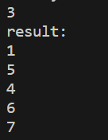
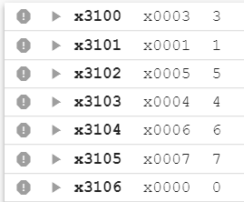
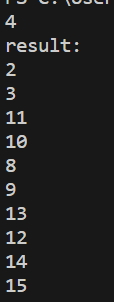
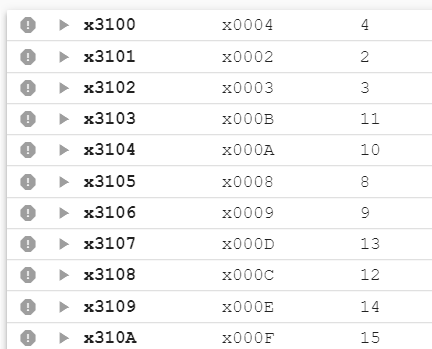
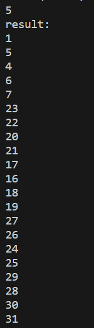
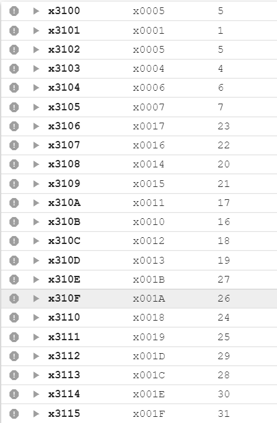

# <center>Lab 4 report</center>

**<center>PB22111711 陈昕琪</center>**

## 实验目的与内容

> 编写一个lc3程序，运用递归算法是是实现`n - 环`问题的解决。
>
> 具体要求：根据存储在`x3100`处的n的值，在x3101及其后面的地址输出`n - 环`问题的解决过程， 

## 逻辑设计

>解决九连环问题，需要递归调用函数
>
>对于`REMOVE`:
>   $$R(0) = nothing\space to\space do$$
>   $$R(1) = remove\space the\space 1^{st}\space ring$$
>   $$R(i) = R(i-2) + remove\space the\space i^{st}\space ring\space + P(i-2) + R(i-1),(i >= 2)$$
>   **（`PUT`和`REMOVE`是互逆的函数）**
>对于`PUT`:
>   $$P(0) = nothing\space to\space do$$
>   $$P(1) = put\space the\space 1^{st}\space ring$$
>   $$P(i) = P(i-1) +  R(i-2) + put\space the\space i^{st}\space ring + P(i-2),(i >= 2)$$

## 程序代码分析

1. 首先将各寄存器清空，便于之后处理数据
由于这里需要用到**递归算法**，因此需要用到`R6`作为栈指针，用来存储指令的位置，同时用`R7`寄存器来实现指令的跳转。
同时，要将`n`的值存进`R0`,并存放地址值和指针值。
`R7`则存放`HALT`(栈底，用于判断程序结束)
```asm
    .ORIG x3000;初始化
    AND R0, R0, #0;用来存储n的值
    AND R1, R1, #0;用来输出操作
    AND R2, R2, #0;用来存放地址值
    AND R3, R3, #0;用来计数
    AND R4, R4, #0;用来操作
    AND R6, R6, #0;n用于移位时计数
    AND R7, R7, #0;
        
    LDI R0, N_value;将n的值存入R0
    LD R2, N_value;存放地址值
    LD R6, Begin;存放指针
    LD R7, EXIT;存放地址
```
2. `REMOVE`函数
+ 进入`REMOVE`函数，首先要将栈顶元素更新，方便下次调用。
+ 根据`REMOVE`函数的定义，首先判断是否为基础值——`0`或`1`。相应跳转到对应语句。若不为初始值，则进行`R(i-2)`的操作，即递归调用函数。
+ 然后进行$remove\space the\space i^{st}\space ring$操作，而此操作反映到结果上是将结果的第`i`位由`0`变为`1`，相当于加$2^{i-1}$，因此加入`R3`和`R4`用于处理`R1`语句。
+ 进行`P(i-2)`操作，只需将`R0`的值对应的变为`i-1`即可，然后跳转到`PUT`函数。
+ 进行`R(i-1)`操作，与前面一样，递归调用`REMOVE`函数即可。
```asm
REMOVE  
    STR R7, R6, #0;
    ADD R6, R6, #1;
    ADD R0, R0, #0;
    BRz Base_r0;判断为是0
    ADD R0, R0, #-1;
    BRz Base_r1;判断为是1
        
    ADD R0, R0, #-1;n-2
    JSR REMOVE
        
    ADD R0, R0, #2;n
    AND R4, R4, #0;
    ADD R4, R4, #1;
    ADD R3, R0, #-1;
LOOP    
    BRz Remove_ist_ring
    ADD R4, R4, R4;
    ADD R3, R3, #-1;
    BRnzp LOOP
    
Remove_ist_ring
    ADD R1, R1, R4
    ADD R2, R2, #1
    STR R1, R2, #0
    
    ADD R0, R0, #-2;n-2
    JSR PUT
        
    ADD R0, R0, #1;n-1
    JSR REMOVE
        
    ADD R0, R0, #1;
        
RETURN_r 
    ADD R6, R6, #-1;弹栈
    LDR R7, R6, #0;
    RET


Base_r1
    ADD R0, R0, #1;
    ADD R1, R1, #1;
    ADD R2, R2, #1;
    STR R1, R2, #0;
Base_r0 
    BRnzp RETURN_r
```
**这里的`RETURN_r`是弹栈操作，即结束函数调用，相当于`C`中的`return`语句**

3. `PUT`函数
根据函数定义，与`REMOVE`函数一样，不断地递归调用，并注意弹栈压栈即可。
**与`REMOVRE`不同的是，PUT操作反映到R1上是减法。**
$put\space the\space i^{st}\space ring$反映到结果上是将结果的第`i`位由`1`变为`0`，相当于减$2^{i-1}$，只需要对`R4`取反加一即可。
```asm
PUT     
    STR R7, R6, #0;
    ADD R6, R6, #1;
    ADD R0, R0, #0;
    BRz Base_p0;判断为是0或1
    ADD R0, R0, #-1;
    BRz Base_p1;
    JSR PUT
    ADD R0, R0, #-1;n-2
    JSR REMOVE
        
    ADD R0, R0, #2;n
    AND R4, R4, #0;
    ADD R4, R4, #1;
    ADD R3, R0, #-1;
LOOP_p  
    BRz Put_ist_ring
    ADD R4, R4, R4;
    ADD R3, R3, #-1;
    BRnzp LOOP_p
    
Put_ist_ring
    NOT R4, R4
    ADD R4, R4, #1
    ADD R1, R1, R4
    ADD R2, R2, #1
    STR R1, R2, #0
        
    ADD R0, R0, #-2
    JSR PUT
    ADD R0, R0, #2;
RETURN_p       
    ADD R6, R6, #-1;弹栈
    LDR R7, R6, #0;
    RET


Base_p1 
    ADD R0, R0, #1;
    ADD R1, R1, #-1;判断为是1
    ADD R2, R2, #1;
    STR R1, R2, #0;
Base_p0 
    BRnzp RETURN_p
```

4. 最后，结束程序。在HALT语句后定义各变量对应的地址
```asm
EXIT        HALT
N_value .FILL x3100;
Begin .FILL x4100;
.END
```


## 测试结果与分析
本次测试借用C语言代码验证正确性，C语言程序要求输入n,运行后直接输出操作数的值。（代码已放进压缩文件中）
测试结果图如下:

1. test1:



<center>C语言程序结果</center>



<center>lc3程序结果</center>

2. test2:



<center>C语言程序结果</center>



<center>lc3程序结果</center>

3. test3:



<center>C语言程序结果</center>



<center>lc3程序结果</center>


由此可见程序正确。

## 遇到的问题及反思
​	本次实验过程中，由于对于栈和递归函数使用不熟练，导致出现一些错误。
> &emsp;对于`R0`，在递归调用完函数时，应在原来的`R0`的值的基础上进行操作。
> 同时，在判断`R0`是否为`1`时，将`R0`减一，所以在`Base_r1`处应当将`R0`先加一，还原`R0`的值，便于之后的递归。

> &emsp;初始写程序时，没有合理进行弹栈操作，导致程序出错。而后联想到`C`语言中`return`语句，将弹栈操作放置在正确的位置后，程序正确。


## 总结
1. 本次实验，通过编写`lc3`程序，深入了解了`lc3`语言以及递归算法，并巩固了课程中学习的栈及其操作的运用。
2. 熟练掌握弹栈、压栈、以及`JSR`语句的运用。能够运用已学的知识实现函数递归操作。
3. 在课程学习中，对栈并未有很清晰的认识。直到自己动手编写程序，调试程序，才对栈的操作过程有了深入了解。同时也熟悉了函数递归的过程。
4. `lc3`语言和`C`语言虽然不同，但是可以借助`C`语言的算法思想，实现更多`lc3`程序。
