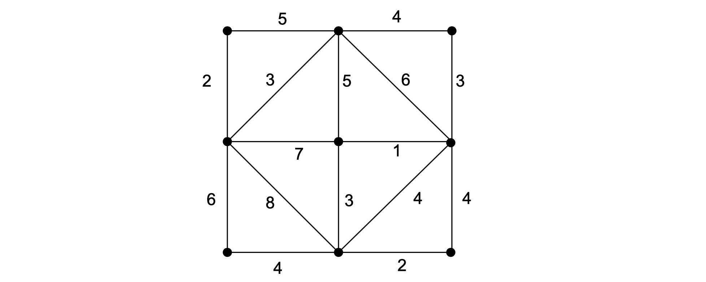
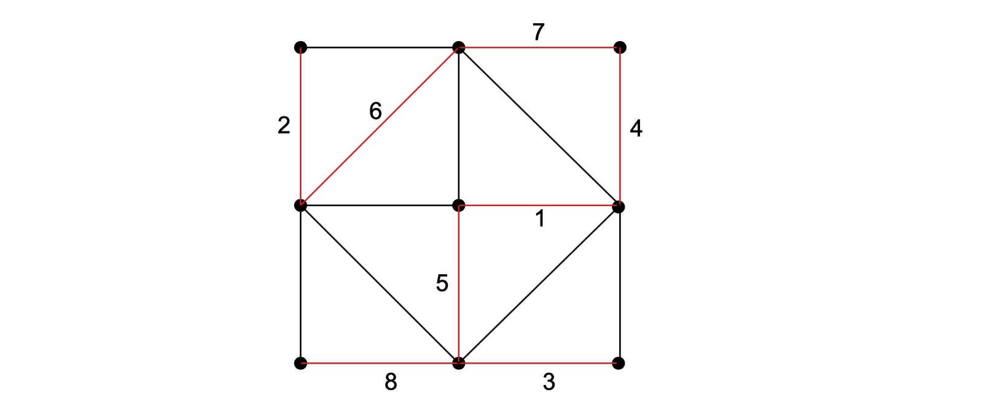
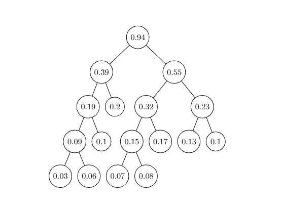

# Ch2

## 2

> 一棵树T有 $ n_i $ 个 度数为 $ i $ 的顶点， $ i = 2,3, \dots , k$  , 其余顶点都是树叶，则T有几片树叶？

由图的性质有：
$$
2 \epsilon(T) = \sum_{i=1}^{k} in_i
$$
由树的性质有：
$$
\epsilon(T) = v(T)-1 =  \sum_{i=1}^{k} n_i -1
$$
上面两个式子联立可得：
$$
n_1 =  \sum_{i=2}^{k}(i-2)n_i +2
$$

## 3

> 证明： 如果一棵树只有两片树叶，则这棵树是一条轨。（反证法）

**证明：**

假设 $\exist T_0$  是一棵只有两片树叶的树 ， 但$T_0$不是轨。

则存在$u$ 使得$ deg(u) \ge 3 $  

又因为$T_0$ 只有两片叶子 。 所以，有$\nu(T_0) - 2$ 个顶点的度数 $\ge 2$  。

于是有 ， $\sum\limits_{v_i\in v(T_0)} deg(v_i)  \ge 1 + 1 + 3 + 2*(\nu (T_0) -3) = 2\nu (T_0) - 1 $

又由欧拉公式，  $\sum\limits_{v_i\in v(T_0)} deg(V_i)  = 2(\nu(T_0) - 1) $

矛盾。

所以，如果一棵树只有两片树叶，则这棵树是一条轨。

## 4

> 证明：如果T是树，且 $ \Delta(T) \geq n$，则T至少有n片树叶

由2.2题的结论我可以可以得到：
$$
n_1 =  \sum_{i=2}^{k}(i-2)n_i +2  \geq (\Delta(T)-2)*1 +2 = \Delta(T) \geq n
$$
得证

## 6

> 证明：树有一个中心或两个中心，且有两个中心时，这两个中心相邻

### 方法一

可以使用删除叶子节点的方法，即证明删除$T$中所有叶子结点后，新树$T'$的中心不变。

对于  $\forall v \in V(T)$，如果要使$d(u,v)$最大，v显然是叶子。那么删除所有 $T$中叶子结点后，必然有：
$$
max_{\forall v \in V(T')}d(u,v) = max_{\forall v \in V(G)}d(u,v)-1
$$

所以u仍为$T'$的中心。

重复执行上述操作，最后只能得到$K_1，K_2$这两种情况，即一个顶点或者两个相邻顶点，得证。

### 方法二

可以用最长轨法证明最长轨的中点为树的中心。
取树的最长轨道。

**引理一：  **中心在最长轨道上。

设最长轨道为$P(v_0,v_n) = v_0e_1v_1···v_ie_{i+1}···v_n $ ,  则$l(v_{\lfloor \frac{n+1}{2} \rfloor}) = \lfloor \frac{n+1}{2} \rfloor$  否则存在更长的轨道。

对任意 $v_i \in P(v_0,v_n) ,  l(v_i) = max\{ dist(v_0,v_i) , dist(v_i,v_n) \} \ge  \lfloor \frac{n+1}{2}\rfloor  = l(v_{\lfloor \frac{n+1}{2} \rfloor}) $  

对任意$v'\notin P(v_0,v_n)$， 存在一点$v_i\in P(v_0,v_n)$ 使得，$P_0(v',v_i)\cap P(v_0,v_n) = v_i$  ，有 $l(v') \ge dist(v',v_i) + max\{ dist(v_i,v_0) , dist(v_i,v_n)\}  > l(v_i) \ge l(v_{\lfloor \frac{n+1}{2} \rfloor}) = \lfloor \frac{n+1}{2} \rfloor $ 

则 $r(G) = min \lbrace l(v)| v \in V  \rbrace =  \lfloor \frac{n+1}{2} \rfloor $

 所以只有在最长轨道上的点可能是中心。

引理得证。

若最长轨道长为偶数，则只有一个点$l(v) =  \lfloor \frac{n+1}{2} \rfloor$，则为一个中心。若为奇数, 则有中间两个相邻点 满足$l(v) =  \lfloor \frac{n+1}{2} \rfloor$，则为中间两个相邻顶点为中心。 

## 8

> 2.8  证明：  若 $d_1 \ge d_2 \ge··· \ge d_v$  是正整数序列 ，则此序列是树的度数序列当且仅当$\sum\limits_{i=1}^{v} d_i = 2(v -1)$ 。

**证明：**

**充分性：** 

 若 $d_1 \ge d_2 \ge··· \ge d_v$  是正整数序列，且是树$T$的度数序列。

则$\sum\limits_{i=1}^{v} d_i = \sum\limits_{v_i \in T}deg(v_i) =2\epsilon = 2(v-1)$ 

**必要性：**

**命题**： $d_1 \ge d_2 \ge··· \ge d_v$  是正整数序列  ， 若$\sum\limits_{i=1}^{v} d_i = 2(v -1)$  则此序列是树的度数序列。

对$v$进行归纳。

当$ v = 2$ 时 ，$d_1 = d_2 = 1$ , 是树的度数序列。

假设，$v = k $ 时命题成立。

则$v = k + 1 时$ ， 若  $\sum\limits_{i=1}^{k+1} d_i = 2(k+1 -1)$

​		必有 $d_{k+1} = 1$ ，否则  $\sum\limits_{i=1}^{k+1} d_i \ge (k+1)d_{k+1}  \ge 2(k+1 )> 2(k+1-1) $ 

​		必有 $d_{1} \ge 2$ ，否则  $\sum\limits_{i=1}^{k+1} d_i \le (k+1)d_{1}  \le (k+1 ) < 2(k+1-1)$		

​		考虑到序列 ， $d_1 - 1 , d_2 , d_3 , ···,d_k$     ，共k 个点 ， 满足归纳假设, 可构成一棵树 。不防设构成树$T_0$ 。连接 $v_0 , v_{k+1}$  。 构成一棵新树 $T_1$ 。 $ T_1 $ 的度数序列即为 $d_1  , d_2 , d_3 , ···,d_{k+1}$ 。 命题成立。

得证。

## 11

> 求 $K_{2,3}$生成树的个数

## 14

> 用Kruskal算法求图中边权图最小的生成树

Kruskal的算法是有限选择边权较小的边，选择的顺序是和Prim算法不一样的是，如下图所示，红色标记的是最小生成树，序号则是顺序。

## 15

> 边权图里的最小生成森林是权最小的生成森林，并且在生成森林中 保持原图中任意两个顶点的连通性。如何修改 Kruskal 算法来构造最小 生成森林，并指出时间复杂度。

**Kruskal算法 ** ：

- 输入：加权图$G = (V(G),E(G),\omega), v=|V(G)|$
- 输出：G的一棵生成树的边子集${e1,e2,\dots,e_{v-1}}$

**过程如下**：

1. 从E$(G)$中选权最小的边$e_1$;
2. 若已经选定边$e_1,e_2,\dots,e_i$，则从$E(G)-{}{e_1,e_2,\dots,e_i}$中选取边$e_{i+1}$，使得
   - (i)边导出子图$G[\{e_1,e_2,\dots,e_i\}]$不含圈；
   - (ii)在满足(i)的前提下，$\omega(e_{i+1})$的权最小，即$\omega(e_{i+1})= min_{e \in E(G)-\{e_1,e_2,\dots,e_i\}}\omega(e)$
3. 反复执行第(2)步，直到选出$e_{v-1}$为止

下面分类讨论：

1. 如果知道G的连通片数，设为k

   则在各连通片上分别执行原Kruskal算法，时间复杂度为：$O(\sum_{i=1}^k \epsilon_ilog\epsilon_i) = O(\epsilon log  \epsilon)$

2. 如果不知道G的连通片数， 则需修改循环中止条件：

   改为反复执行第(2)步，直到从剩余边集中选出任意一条边都会使边导出子图$G[\{e_1,e_2,\dots,e_i\}]$含圈

   时间复杂度为$O(\epsilon log  \epsilon)$

## 20

> 画出带权 0.2,0.17,0.13,0.1,0.1,0.08,0.06,0.07,0.03 的 Huffman 树

需要注意的是此题的权重之和并不是1，许多人误以为权重之和必须是1。

## 22

> 证明引理2.1 
>
> 给定$\omega_1 \leq\omega_2 \leq \dots \leq\omega_t$，则存在一课Huffman树，使得$\omega1,\omega2$对应的顶点时兄弟，且这两个顶点在二叉树中的深度都等于树高

不妨设$w_i$对应的顶点为$v_i,i=1,2,\dots,t$，假设任意Huffman树中$v_1$中的深度不等于树高，即存在$v_k,2\leq k\leq t$，使得$v_k$的深度等于树高 ，显然有$L(v_k)\geq L(v_1)$。

因为
$$
WPL(T) = w_1L(v_1) + w_2L(v_2) + \dots + w_tL(v_t)
$$
且
$$
w_1 \leq w_2 \leq \dots \leq w_t
$$
交换$v_1,v_k$的位置，得到$T'$ ，则有
$$
\begin{align}
WPL(T')& = w_1L(v_k) + w_2L(v_2) + \dots + w_tL(v_1) \\
 & = WPL(T) + (w_1-w_k)[L(v_k)-L(v_1)]\
\end{align}
$$

1. 当$w_1 = w_k$时，$WPL(T') = WPL(T)$，与树$T'$同为Huffman树；
2. 当$w_1 \lt w_k$时，$WPL(T') \le WPL(T)$，与树$T$为Huffman矛盾；

则$v_1$的深度等于树高，且同理可证得
$$
L(v_1) \geq L(v_2) \geq\dots \geq L(v_t)
$$
若$v_1$无兄弟，则由Huffman树WPL最小规则，$v_1$的深度还可以再缩短直至$v_1$有兄弟。

由$L(v_1) \geq L(v_2) \geq\dots \geq L(v_t)$可得$v_2$为$v_1$的兄弟，则有$\omega1,\omega2$对应的顶点为兄弟，且这两个顶点在二叉树中的深度都等于树高。

## 23

> 证明Huffman树是最优二叉树。

设叶子结点的权值分别为$\omega_1\le\omega_2\le ···\le \omega_n$

1. 首先证明存在一颗最优二叉树，使得$\omega_1$和$\omega_2$是兄弟，且它们的深度等于树的高度。(为方便，我们用权值$\omega_i$来表示对应的顶点)

   任取一颗最优二叉树$T$，若$\omega_1$的深度小于树高，设$w_i$和$w_j$是$T$中最深的两个顶点，不妨设$i\ne2$。交换$\omega_1$和$\omega_i$，得到的新树$T'$加权路径长度不增，故也为最优二叉树，若$j\ne2$，则交换$\omega_2$和$\omega_j$，得到的新树$T''$的加权路径长度不增，故也为最优二叉树。如此，我们就得到了一颗最优二叉树，使得$\omega_1$和$\omega_2$是兄弟，且它们的深度等于树的高度。

2. 再用对树的叶子节点数n进行归纳：$n=2$时，结论成立。设$n=k$时结论成立，考虑$n=k+1$情形:

   设$T_{k+1}$为叶子结点的权值分别为$\omega_1\le\omega_2\le ···\le \omega_{k+1}$的最优二叉树，在$T$中$\omega_1$和$\omega_2$是兄弟，将$w_1$和$\omega_2$删去并保留其父节点并令父节点的权值为$\omega_1+\omega_2$得到新树$T'_k$.

   由Huffman树的构造过程，必然存在两个权值最小的结点构成兄弟，不妨设形成的Huffman树$T'_{k+1}$中$\omega_1$和$\omega_2$是兄弟（否则可以调整权值的下标使其成为兄弟），将$w_1$和$\omega_2$删去并保留其父节点并令父节点的权值为$\omega_1+\omega_2$得到新树$T_k$.则$T_k$是叶子结点权值为$\omega_1+\omega_2,\omega_3,···,\omega_{k+1}$形成的Huffman树，由归纳假设，$T_k$为最优二叉树。

   我们有
   $$
   WPL(T_{k+1})=WPL(T'_k)+\omega_1+\omega_2\\
   WPL(T'_{k+1})=WPL(T_k)+\omega_1+\omega_2\\
   WPL(T_{k+1})\le WPL(T'_{k+1})\\
   WPL(T_{k})\le WPL(T'_k)
   $$
   故有$WPL(T'_{k+1})=WPL(T_{k+1})$，所以$T'_{k+1}$也为最优二叉树，即$n=k+1$情形结论成立。

   有归纳原理知，结论成立。

## 25

> 证明： 在$v \geq 3$阶的连通图G中 ，存在至少两个顶点，从G中删除这两个顶点后所得图仍为连通。

由推论2.2可知连通图$G$有生成树，记为$T$。

由定理2.2可知树T至少有两片叶，记为$v_1,v_2$。

从$T$中删去$v_1,v_2$得树$T'$显然$T'$仍然连通

从G中删去$v_1,v_2$得到图中$G'$，易知$\forall u_1,u_2 \in V(G'), u_1,u_2 \in V(T')$且存在轨道$p(u_1,u_2) \in E(T') \subseteq E(G')$， 则$G'$ 仍然连通。
