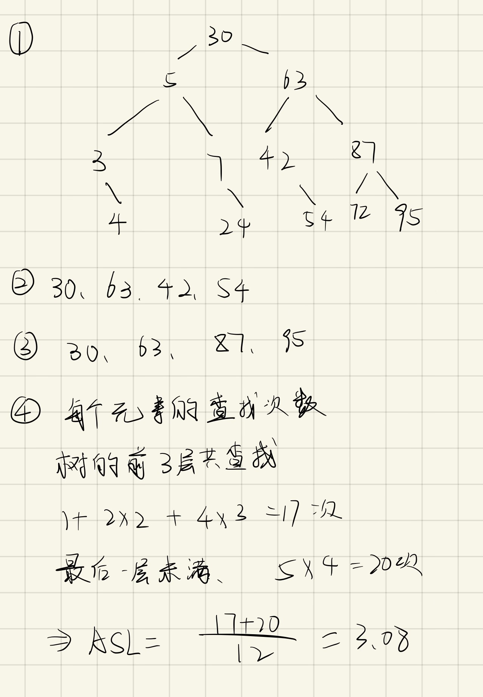
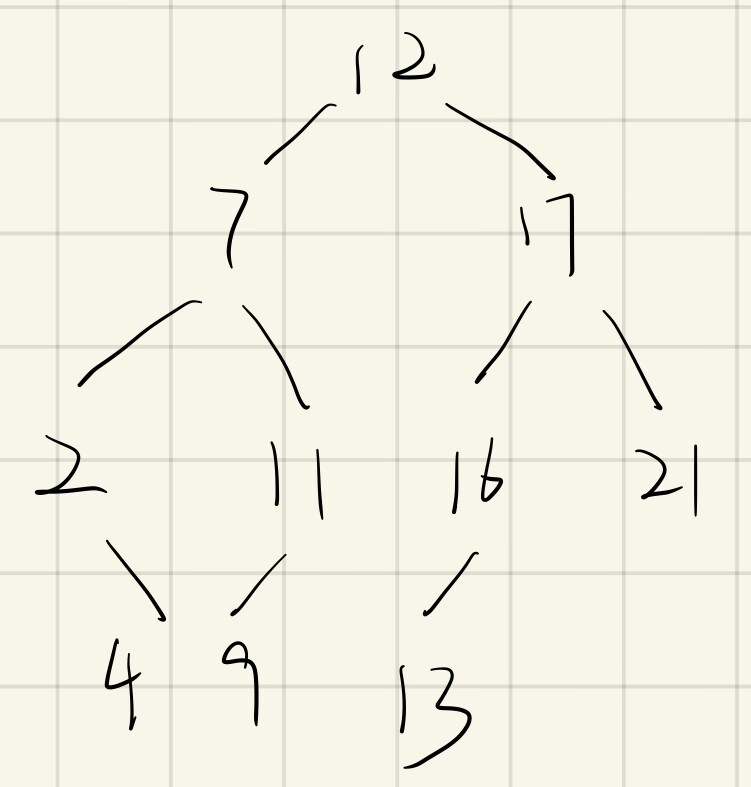

# 11.22
## 1. 选择题
### (5)B
对于22个记录的有序表，那么折半查找的树的深度为$log_{2}22+1=5$，且该树不是满二叉树，即查找失败时至多比较5次，至少比较4次。
## 2. 应用题
### （1）
>假定对有序表（3，4，5，7，24，30，42，54，63，72，87，95）进行折半查找，试回答下列问题。

① 画出描述折半查找过程的决策树。

② 若查找元素54，需依次与哪些元素比较？

③ 若查找元素90，需依次与哪些元素比较？

④ 假定每个元素的查找概率相等，求查找成功时的平均查找长度。

#### (2) 
> 在一棵空的二叉排序树中依次插入关键字序列（12，7，17，11，16，2，13，9，21，4），请画出所得到的二叉排序树。

