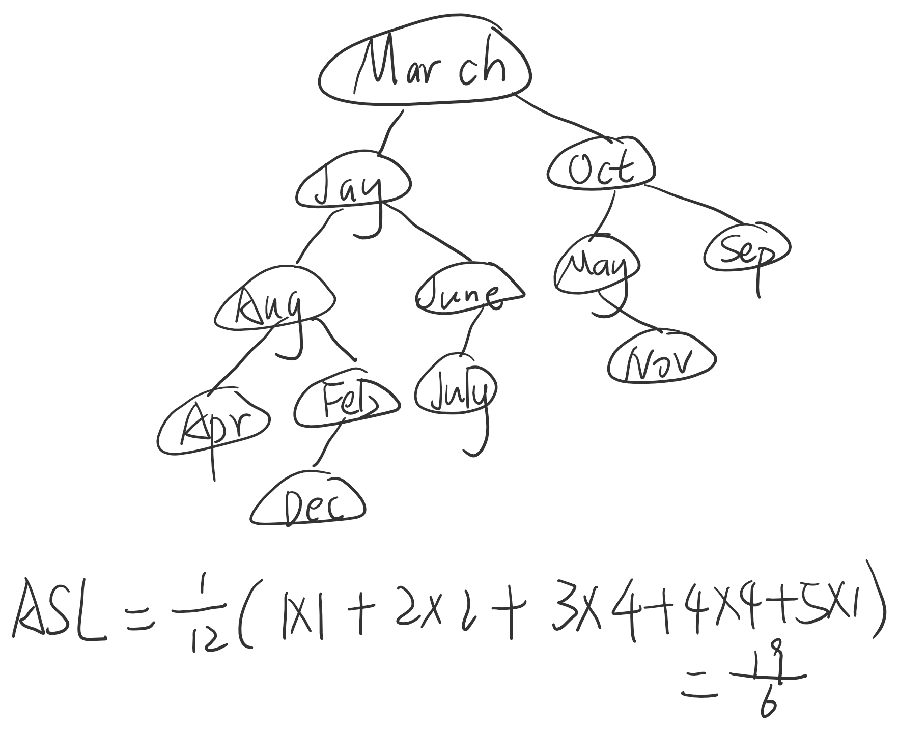

# <center>11.22</center>

## 1. 选择题
### (8) C
> 由题可知，A的左孩子的平衡因子是0，右孩子的平衡因子是1，所以是因为在结点A的右孩子的左子树上进行插入，插入使结点A失去平衡，符合RL型，因此应当以RL型调整

## 2. 应用题
### （3）
题目要求画出一颗二叉排序树，并求其在等概率的情况下查找成功的平均查找长度。画出的结点如下：
(之前没有按照字典序插入，以下是更正后的结果)




## 3.算法设计题

#### (5)求一颗带有平衡因子标注的平衡二叉树的高度
算法思路：对于带有平衡因子标注的平衡二叉树的，从根结点开始，当平衡因子为0时，则左右两边都可以继续搜索（这里默认搜索左子树）；当平衡因子为1时，则向左边继续搜索；当平衡因子为-1时，则向右边继续搜索，直到结点为空即探寻到叶子结点为止。
注：这里用b来表示平衡因子（定义在表示结点的结构体里）
```cpp
int Height(BSTree t)
{
	level=0;
    p=t;
	while(p)
	{
		level++; 
		if(p->b == -1) p=p->rchild; 
		else p=p->lchild;
	}
	return level;
}
```