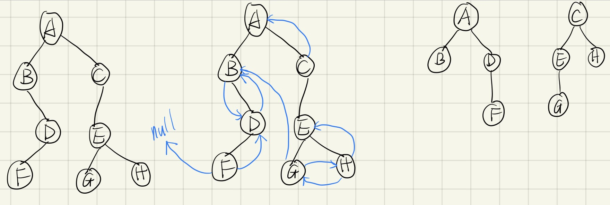

# 10.25

**陈昕琪 PB22111711**

## 1. 选择题
### (3) D
由二叉树结点的公式：n=n0+n1+n2=n0+n1+(n0-1)=2n0+n1-1
n0:叶子节点个数
n1:有一个孩子的结点个数
n2:有两个孩子的结点个数
因为n=1001,所以1001=2n0+n1-1,在完全二叉树中，n1只能取0或1,在本题中只能取0，故n0=501

### (7) C
由于其每个结点的编号大于其左右孩子的编号，所以先遍历该结点的孩子，再遍历该结点。
在一结点的左右孩子中，由于其左孩子的编号小于其右孩子的编号，所以先遍历左孩子再遍历右孩子。
由此可知，遍历的顺序为：左孩子→右孩子→根结点。可采用后序遍历。

### (8) B
树中结点总个数=（所有的结点的度数）+1
在树中，除了根节点没有前驱结点，其他节点有且只有一个前驱节点
而父结点的‘度’是子结点的个数，而每个子结点前驱结点都是该父结点
因此，所有结点的“度”加起来，就是把所有结点子结点的个数加起来
又因为，根结点没有父节点，所以所以没有把根结点算计进来
得出：树中结点总个数=（所有的结点的度数）+1(根节点)
由题意可知：
所有结点个数=20x4+10x3+1x2+10x1+1(根结点)=123个结点
所以，叶子节点个数=123-20-10-1-10=82

### (12) C
X是非根节点，且其有左子树，则其中序线索的前驱即为其左子树按中序遍历的最后一个节点，也就是其左子树中的最右节点。

### (14) C
题目非终端结点为n,那么假设设森林总结点为m，终端结点（即叶子结点）为 m-n，总指针域就是2*m
根据二叉树的特性，可知，在m个结点的二叉链表中，有m+1个空指针域
终端结点转化为二叉树后，该结点没有左孩子，左指针域就为空，即m-n
所以右指针域为空的个数为：m+1-(m-n)=n+1

## 2. 应用题
如图所示：


## 3.算法设计题
(2) 算法思路：
用递归算法和分治算法，判断两棵树是否相等。
算法实现如下：
```cpp
int isSameTree(TreeNode* p, TreeNode* q) {
	//先判空，两棵树均为空，则是相同的树
	if (p == NULL && q == NULL) {
		return 1;
	}
	//只有一棵树是空树，则必不是相同的树
	if (p == NULL || q == NULL) {
		return 0;
	}
	//其他情况，左子树相同，右子树相同，结点的值相同
	return p->value == q->value&&
		isSameTree(p->left, q->left) &&
		isSameTree(p->right, q->right);
}
```
(3) 算法思路：
求最大宽度可采用层次遍历的方法，定义一个队列，先把树的根结点入队，每次出队一个结点如果有他有孩子结点就把孩子结点入队以此类推。
记下各层结点数，每层遍历完毕，若结点数大于原先最大宽度，则修改最大宽度。
算法实现如下：
```cpp
int Width(Tree T)
{
        if (T == NULL)  return 0;//树空宽度为0
        SeqQueue Q;//建立一个队列
        int temp = 0, last = 0, max = 0;//暂存temp层的宽度用来和最大值比较，last一层的最后一个结点在队列中的位置
        ElemType e = T;
        InitQueue(&Q);//初始化队列
        InQueue(&Q, &e);//根节点入队
        while (Q.front <= last)
        {
                OutQueue(&Q, &e);//出队
                temp++;
                if (e->lchild != NULL)//有左孩子结点
                {
                        InQueue(&Q, &e->lchild);//入队
                }
                if (e->rchild != NULL)//有右孩子结点
                {
                        InQueue(&Q, &e->rchild);//入队
                }
                if (Q.front > last)//一层结点全部遍历完成
                {
                        last = Q.rear-1;
                        max = max > temp ? max : temp;//更新最大宽度
                        temp = 0;
                }
        }
        return max;
}
```