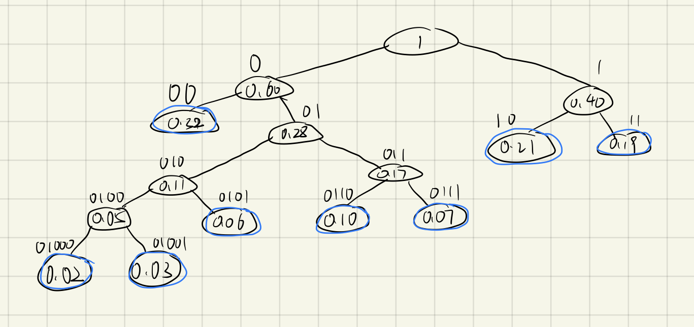

# 11.1

**陈昕琪 PB22111711**

## 2. 应用题
### (3) 
> &emsp;画出哈夫曼树如下图，规定左边编号为0，右边编号为1，则可得出哈夫曼码。



> &emsp;对于八个数，则可以用三位二进制表示等长编码，如下表。
> 
|频率|哈夫曼码|等长编码|
|---|---|---|
|0.07|0111|000|
|0.19|11|001|
|0.02|01000|010|
|0.06|0101|011|
|0.32|00|100|
|0.03|01001|101|
|0.21|10|110|
|0.10|0110|111|

> &emsp;定长编码明显比哈夫曼编码更加简单。但是，哈夫曼编码是最优前缀编码。对于n个字符的数据文件来说，分别以它们的出现次数为权值构造哈夫曼树，则该树对应的哈夫曼编码对文件进行编码，能够使得该文件压缩过后对应的二进制文件的长度最短。

## 3. 算法设计
> ### 以二叉链表作为二叉树的存储结构，设计算法输出二叉树中从每个叶子节点到根节点的路径。

> 代码如下
```cpp
#include<stdio.h>
#include<stdlib.h>
#define MAX 20
typedef struct BiNode {
	char data;
	struct BiNode *lchild, *rchild;
}BiNode, *BiTree;
 
//创建二叉树
void CreateBTree(BiTree &T) {
	char ch;
	int i;
	scanf("%c", &ch);
	if (ch == '#')T = NULL;//给左或右赋值为NULL
	else {
		T = new BiNode;
		T->data = ch;
		CreateBTree(T->lchild);//根变成左子 
		CreateBTree(T->rchild);//根变成右子 
	}
}
//输出二叉树中从每个叶子结点到根结点的路径
void PathTree(BiTree T, char path[], int location)
{	
	if (T == NULL) return;
	if (T->lchild == NULL && T->rchild == NULL)//如果是叶子则存到数组
	{
		path[location] = T->data;
		printf("%c path: ", T->data);//输出叶子结点作为题目
		for (int i = location; i >= 0; i--)
			printf("%c ", path[i]);
		printf("\n");
	}
	else
	{
		path[location] = T->data;//从根开始传入数组
		location++;
		PathTree(T->lchild, path, location);//遍历根
		PathTree(T->rchild, path, location);//遍历根
		location--;//此时location的位置是没有值的，所以要location--
	}
}

int main() {
	BiTree T;
	char path[MAX];
	int location = 0;
	printf("Input:\n");
	CreateBTree(T);//建立 
	PathTree(T,path,location);//输出各叶子到根的路径
	return 0;
}
```
#### 算法分析
> 首先，用先序遍历建立树。
> 然后，从根开始遍历树，运用递归算法，对每个结点分别遍历左子树和右子树，并同时记录路径。
> 这种方法可以确定遍历所有结点并且同时记录每个结点到根节点的路径。
> 当判断为叶子结点时，可以根据已经记录的路径输出从叶子结点到根节点的路径。