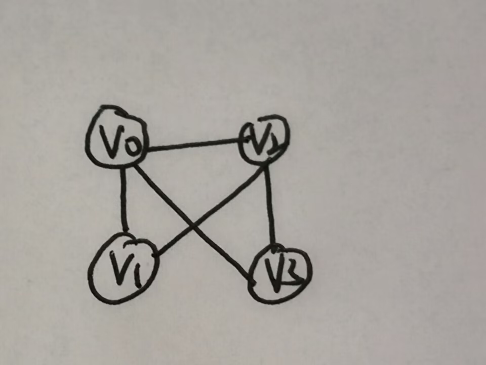
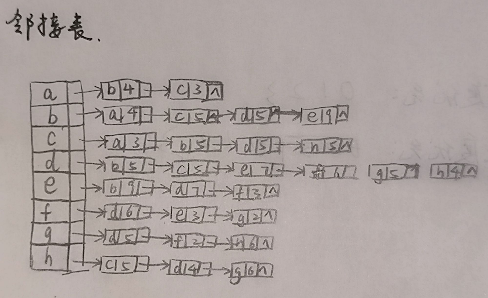
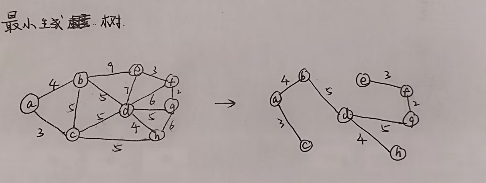
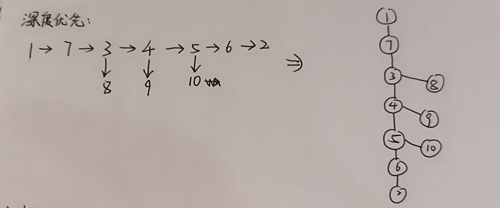
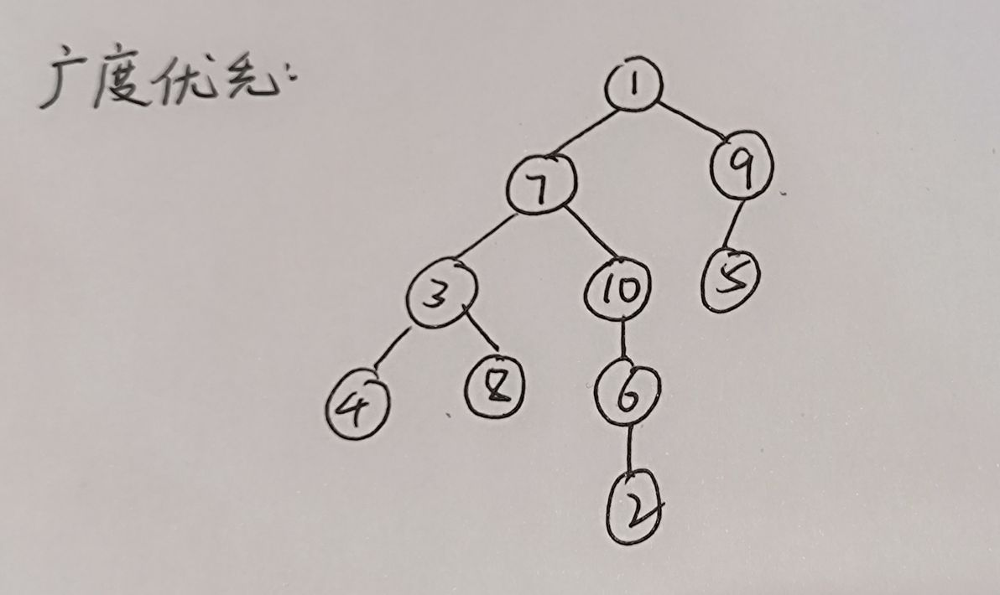
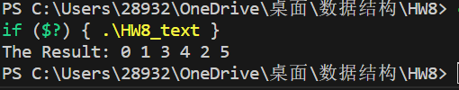

# 11.8

**陈昕琪 PB22111711**

## 1.选择题
### (5) C
> &emsp;无向图最多有n*(n-1)/2条边，因此28条边的有向图最少有8个顶点，再添加一个孤立点就构成了非连通图，因此至少有9个顶点。

### (14)D,D
根据邻接表画出的图如图：



根据深度优先遍历和广度优先遍历的定义可得，两种方法得到的结果是一样的，都是0 1 2 3。
## 2.应用题
> ### (2)画出邻接矩阵，邻接表和最小生成树。






> ### (3)画出的深度优先生成树和广度优先生成树如下图：





## 3. 算法设计题
> ### (2)一个连通图采用邻接表作为存储结构，设计一个算法，实现从顶点v出发的深度优先遍历的非递归过程。

### 程序代码如下：
```cpp
#include <stdio.h>
#include <stdlib.h>

#define MAX_VERTICES 100

//创建结点
typedef struct Node {
    int vertex;
    struct Node* next;
} Node;

//创建链表
typedef struct Graph {
    int numVertices;
    Node* adjLists[MAX_VERTICES];
    int visited[MAX_VERTICES];
} Graph;

//创建图
Graph* createGraph(int vertices) {//根据结点个数创建图
    Graph* graph = (Graph*)malloc(sizeof(Graph));
    graph->numVertices = vertices;

    for (int i = 0; i < vertices; i++) {
        graph->adjLists[i] = NULL;
        graph->visited[i] = 0;//初始化visited[n]
    }

    return graph;
}

//加边
void addEdge(Graph* graph, int src, int dest) {
    //在两个结点之间加边，即进行链表指针域连接
    Node* newNode = (Node*)malloc(sizeof(Node));
    newNode->vertex = dest;
    newNode->next = graph->adjLists[src];
    graph->adjLists[src] = newNode;

    //由于是无向图，要进行两次加边操作
    newNode = (Node*)malloc(sizeof(Node));
    newNode->vertex = src;
    newNode->next = graph->adjLists[dest];
    graph->adjLists[dest] = newNode;
}

//非递归的深度优先算法
void DFS(Graph* graph, int startVertex) {
    int stack[MAX_VERTICES];//定义一个数组作为栈
    int top = -1;//栈顶指针

    stack[++top] = startVertex;//将起点压入栈中

    while (top >= 0) {
        int currentVertex = stack[top--];

        if (!graph->visited[currentVertex]) {//visited[n]为0，即还未被访问，需要输出
            printf("%d ", currentVertex);
            graph->visited[currentVertex] = 1;//标记为访问过
        }

        Node* temp = graph->adjLists[currentVertex];

        while (temp) {//遍历所有的邻接结点
            int adjVertex = temp->vertex;

            if (!graph->visited[adjVertex]) {//存入还未被访问过的结点
                stack[++top] = adjVertex;
            }

            temp = temp->next;
        }
    }
}

//释放空间
void freeGraph(Graph* graph) {
    if (graph) {
        for (int i = 0; i < graph->numVertices; i++) {
            Node* node = graph->adjLists[i];
            Node* temp;

            while (node) {
                temp = node;
                node = node->next;
                free(temp);
            }
        }

        free(graph);
    }
}

// Sample test case
int main() {
    Graph* graph = createGraph(6);

    addEdge(graph, 0, 1);
    addEdge(graph, 0, 2);
    addEdge(graph, 1, 3);
    addEdge(graph, 1, 4);
    addEdge(graph, 2, 4);
    addEdge(graph, 3, 4);
    addEdge(graph, 3, 5);

    printf("The Result: ");
    DFS(graph, 0);

    freeGraph(graph);

    return 0;
}
```

#### 其中深度优先算法部分如下：
```cpp
void DFS(Graph* graph, int startVertex) {
    int stack[MAX_VERTICES];//定义一个数组作为栈
    int top = -1;//栈顶指针

    stack[++top] = startVertex;//将起点压入栈中

    while (top >= 0) {
        int currentVertex = stack[top--];

        if (!graph->visited[currentVertex]) {//visited[n]为0，即还未被访问，需要输出
            printf("%d ", currentVertex);
            graph->visited[currentVertex] = 1;//标记为访问过
        }

        Node* temp = graph->adjLists[currentVertex];

        while (temp) {//遍历所有的邻接结点
            int adjVertex = temp->vertex;

            if (!graph->visited[adjVertex]) {//存入还未被访问过的结点
                stack[++top] = adjVertex;
            }

            temp = temp->next;
        }
    }
}
```

#### 算法分析
> &emsp;使用一个数组作为栈来实现非递归的深度优先搜索。
> &emsp;首先，定义一个大小为MAX_VERTICES的整型数组stack作为栈，并初始化top为-1，表示栈为空。
> &emsp;接下来，在DFS函数中，将起始顶点startVertex压入栈中，然后进入循环。不断得遍历邻接结点。
> &emsp;在循环中，首先从栈中弹出一个顶点currentVertex，通过visited[n]判断是否被访问过，若未访问过，则将其标记为已访问，并打印该顶点。
> &emsp;然后，遍历当前顶点的邻接节点，若邻接节点未被访问过，则将其压入栈中。遍历完之后再循环判断。若该点邻接结点都以遍历，但是还有结点没有遍历，则会回退到之前的结点，继续遍历。直到所有结点都遍历完，top回到-1，栈为空。
&emsp;这样就完成了非递归的深度优先搜索。

#### 运行测试
> &emsp;在主函数中直接定义了一个图，并且得到了一下结果，分析得知结果正确。

