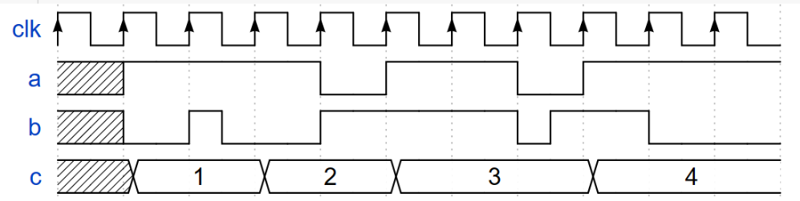

# Lab 2 report

**PB2111711 陈昕琪**


## 实验目的与内容
---
> 1. 借助 Vivado 帮助完成 Verilog 的开发流程。
> 2. 了解如何使用 Vivado 进行RTL分析与仿真操作。
> 3. 进一步熟悉 Verilog 语言并编写仿真文件进行测试。

### 1. 必做内容：if 语句与锁存器
---
> #### 要求：
> &emsp;为消除锁存器，应当使组合逻辑过程块中的条件完备，即 if 语句后应加上 else 语句。修改上述代码，以消除锁存器
> #### 逻辑实现：
> &emsp;为了避免锁存器，应当补全 if-else 逻辑，根据所给的代码框架和题目描述，补全每一种可能出现的情况。
#### 代码如下：(已在Verilog OJ提交并通过)
```v
module top_module (
    input		cpu_overheated		,
    output	reg	shut_off_computer	,
    input      	arrived				,
    input      	gas_tank_empty		,
    output 	reg keep_driving
);
  	// Edit the code below
	always @(*) begin
    	if (cpu_overheated)
        	shut_off_computer = 1'b1;
        else shut_off_computer = 1'b0;
    end

    always @(*) begin
    	if (~arrived)
        	keep_driving = ~gas_tank_empty;
        else keep_driving = 1'b0;
    end
endmodule
```

### 2. 必做内容：case 语句与锁存器
---
> #### 要求：
> &emsp;将所给代码补充完整，以实现期望的电路功能。
> #### 逻辑实现：
> &emsp;根据题目所给的代码框架，在 case 语句之前给每个变量赋好了默认值，根据题目依次列出扫描码可能的值。
#### 代码如下：(已在Verilog OJ提交并通过)
```v
module top_module (
    input [15:0] scancode,
    output reg left,
    output reg down,
    output reg right,
    output reg up  ); 
    
    always @(*) begin

    up = 1'b0; down = 1'b0; left = 1'b0; right = 1'b0;

    case (scancode)
        16'he06b: left = 1'b1;
        16'he072: down = 1'b1;
        16'he074: right = 1'b1;
        16'he075: up = 1'b1;
        default: ;
    endcase

end

endmodule
```
>注：原本的代码中没有default语句，在实验检查前，和助教讨论的过程中得知，虽然default语句在这里不是必须，但是加入default语句后代码更加规范，因此在最终的代码中加入了default语句。

### 3. 必做内容：生成波形
---
> #### 要求：
> &emsp;编写仿真文件，生成下图所示的波形。时钟周期设定为 10ns。

> #### 逻辑实现：
> &emsp;观察图中的波形,对于abc的变化状态，将波形分为几个部分。根据对应的时间编写仿真文件。
> 初始化clk,a,b的值分别为1,1,0。c的位宽为8，初始值为8.
> 用**always #5 clk = ~clk;**语句实现clk翻转。
> **#**用来控制时间。在对应的时间进行相应的赋值和翻转
#### 代码如下：(直接编写仿真文件并运行)
```v
module Q3_tb();
reg clk,a,b;
reg [7:0] c;

initial begin
    c = 8'b0000_0000;
    clk = 1'b1;
    a = 1'b1;
    b = 1'b0;
    #10;

    c = 8'b0000_0001;
    #10;

    b = ~b;
    #5;
    
    b = ~b;
    #5;

    c = 8'b0000_0010;
    #10;

    a = ~a;
    b = ~b;
    #10;

    a = ~a;
    c = 8'b0000_0011;
    #20;

    a = ~a;
    b = ~b;
    #5;

    b=~b;
    #5;

    c = 8'b0000_0100;
    a = ~a;
    #10;

    b = ~b;
end

always #5 clk = ~clk;
endmodule
```
#### 仿真结果与分析
> 仿真得出的波形图如下：


> 对比助教给出的仿真波形，可以判断仿真文件正确。

### 4. 必做内容：计数器Pro
---
> #### 要求：
> &emsp;对已有的计数器代码进行改进，要求实现
>1. 使计数器的最小值可以由模块参数 MIN_VALUE 指定。
>2. 在 1 的基础上，增加一个 1bit 输入信号 enable 用于控制计数器的工作状态。enable 为高电平时，计数器在 MIN_VALUE 至 MAX_VALUE 之间正常工作；enable 为低电平时，counter 变量复位并保持在 0。从 enable 变为低电平开始到 counter 复位并保持在 0 的间隔不超过三个时钟周期。rst 信号的优先级应当高于 enable 信号。
> #### 逻辑实现：
> &emsp;根据要求，增加模块参数 MIN_VALUE。每次时钟上升沿，首先判断rst是否为高电平。若为高电平则复位为0。
> 之后判断enable是否为高电平，并根据相应的情况执行相应的语句。
> **注意：**
> 1. 程序中应当包含完整的if-else语句，防止出现程序原则上错误或出现锁存器。 
> 2. 注意区分复位与最小值的区别，counter复位为0之后还需从最小值开始增值。
#### 代码如下：
```v
module Counter #(
    parameter   MIN_VALUE = 8'd0,
    parameter   MAX_VALUE = 8'd100
)(
    input                   clk,
    input                   rst,
    input                   enable,
    output                  out
);

reg [7:0] counter;

always @(posedge clk) begin
    if (rst) begin
        counter <= 0;//复位为0
    end else if (enable) begin//enable为高电平
        if (counter >= MAX_VALUE) begin//max和min之间工作
            counter <= MIN_VALUE;
        end
        else if(counter >= MIN_VALUE)
            counter <= counter + 1;
        else counter <= MIN_VALUE;
    end 
    else 
        counter <= 0;//counter复位为0
end

assign out = (counter == MAX_VALUE);

endmodule
```
#### 仿真结果与分析
> 根据所写的计数器代码，编写相应的仿真文件验证其正确性。
#### 仿真文件代码如下：
```v
module q4_tb();
reg clk, rst, en;
wire out_TA;
initial begin
    clk = 0; rst = 1; en = 0;
    #10;
    rst = 0;
    #10;
    en = 1;
    #20;
    en = 0;
    #20;
    en = 1;
    #20;
    rst = 1;
    #20;
    rst = 0;
    #200;
    en = 0;
end
always #5 clk = ~clk;
Counter #(
    .MIN_VALUE(8'd10), 
    .MAX_VALUE(8'd13)
) counter (
    .clk(clk),
    .rst(rst),
    .enable(en),
    .out(out_TA)
);
endmodule
```

> 仿真得出的波形图如下：


> 对比助教给出的仿真波形，判断程序正确。

### 5. 选择性必做内容(题目3)：众数统计
---
> #### 要求：
> &emsp;设计一个模块，实时输出对于任意给定数目8bits 无符号整数中出现次数超过一半的数（如果不存在则可以输出序列中任意一个数）。结合 Vivado 仿真验证自己设计的正确性。 假定输入的数个数不超过 100。
> #### 逻辑实现：
> &emsp;在这个程序中，我定义了一个数组，记录每个数字出现的次数，索引值为出现的数字，并且记录当前出现次数最大的数字。并对于更新数组时，定义一个整数用于循环给数组赋初值。以及flag用于判断temp是否可以输出。
> rst 有效时会清除先前的记录，视作从下一个数开始为第一个数，此时给数组重新赋值为0并给temp赋值为0
> next 有效时代表此时通过 number 输入了一个数。此时首先给数组中对应的元素加一，并对number和temp出现的次数进行比较，相应的给temp赋值。
> 最后，out 输出temp的值。
#### 代码如下：
```v
module FindMode (
    input                               clk,
    input                               rst,
    input                               next,
    input       [7:0]                   number,
    output reg  [7:0]                   out
); 

reg [7:0] count[255:0]; // 记录每个数字出现的次数
reg [7:0] temp;         // 记录当前出现次数最大的数字
integer i;//用于数组赋初值
//integer flag;//用于判断temp是否算出

always @(posedge clk) begin//上升沿
    //flag <= 0;
    if (rst) begin
        temp <= 0;
        for (i = 0; i <= 255; i = i + 1) begin
            count[i] <= 0;
        end
        //flag <= 1;
    end
    else if (next) begin
        count[number] <= count[number] + 1;
        if(count[number]+1 >= count[temp]) begin//比较
            temp <= number;
            //flag <= 1;
        end
        else begin
            temp <= temp;
            //flag <= 1;
        end
    end
end

//输出的是当前出现次数最大的值
//如果有相同的，输出的是新的number

always @(*) begin
    out = temp;
end

endmodule
```
> 在编写代码并仿真测试的过程中，发现out总是晚输出一个周期，和助教讨论之后，判断原因为时序电路各语句是同步的。且助教在检查时指出程序存在的一个小错误，以及flag的不必要性。
> 总结原因为没有完全掌握时序电路的知识，并且没有熟练运用。

#### 仿真结果与分析
> 根据所写的代码，编写相应的仿真文件验证其正确性。
> 输入的number序列为：10,20,30,10,10,20,30,30,30,10,10,10
> 输出应当为：10,20,30,10,10,10,10,30,30,10,10,10
> 并在中间插入rst为高电平的一段时间，判断是否清除原来的记录。
#### 仿真文件代码如下：
```v
module FindMode_tb;
reg clk;
reg rst;
reg next;
reg [7:0] number;
wire [7:0] out;

FindMode dut (
    .clk(clk),
    .rst(rst),
    .next(next),
    .number(number),
    .out(out)
);

initial begin
    clk = 1;
    forever #5 clk = ~clk;
end

initial begin
    rst = 1;
    next = 0;
    number = 0;
    #10 rst = 0;
    #10 next = 1;
    number = 8'h10;
    #10 next = 1;
    number = 8'h20;
    #10 next = 1;
    number = 8'h30;
    #10 next = 1;
    number = 8'h10;
    #10 next = 1;
    number = 8'h10;
    #10 next = 1;
    number = 8'h20;
    #10 next = 1;
    number = 8'h30;
    #10 next = 1;
    number = 8'h30;
    #10 next = 1;
    number = 8'h30;
    #10 next = 1;
    number = 8'h10;
    #10 next = 1;
    number = 8'h10;
    #10 next = 1;
    number = 8'h10;
    #10
    rst = 1;
    next = 0;
    number = 0;
    #10 rst = 0;
    #10 next = 1;
    number = 8'h10;
    #10 next = 1;
    number = 8'h20;
    #10 next = 1;
    number = 8'h30;
    #10 next = 1;
    number = 8'h10;
    #10 next = 1;
    number = 8'h10;
    #10 next = 1;
    number = 8'h20;
    #10 next = 1;
    number = 8'h30;
    #10 next = 1;
    number = 8'h30;
    #10 next = 1;
    number = 8'h30;
    #10 next = 1;
    number = 8'h10;
    #10 next = 1;
    number = 8'h10;
    #10 next = 1;
    number = 8'h10;
    $finish;
end
endmodule
```

> 仿真得出的波形图如下：


> 对比分析得知程序正确。

## 总结

> 1. 本次实验，对于 if-else 语句有了更深入的了解，需要补全每种情况，以保证程序的完整与正确。
> 2. 学会编写仿真文件，并根据波形分析判断程序的正确性。
> 3. 本次实验前以及检查过程中，发现自己对于时序逻辑电路还没有掌握运用好。以至于程序出现问题(已经扣了0.5呜呜)，对于现今轻量级的数据处理不会出错，但是对于更多的数据处理则无法得出准确的结果。在编写代码时应当注意电路的逻辑以及同步问题。