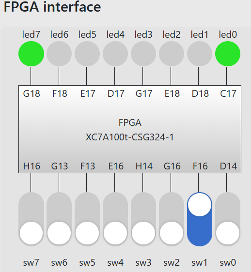

# Lab 4 report

**PB2111711 陈昕琪**


## 实验目的与内容
---
> 1. 通过进一步学习模块化的思想，学习将一些常见的组合逻辑电路用 Verilog 硬件描述语言实现。
> 2. 学习组合逻辑电路分析的基本技巧，并自主设计组合逻辑电路。
> 3. 进一步熟悉 Verilog 语言并学会综合分析电路以及功能实现。

### 1. 必做内容：编码器 Pro
---
> #### 要求：
> &emsp;对于已给出的编码器代码，增加一个输出信号 en，在当前输入有效（I != 4'b0000）时输出 1，无效时输出 0。将 Verilog 代码补充完整，以实现预期的功能。
> &emsp;为了检验结果的正确性，在 FPGAOL 平台上运行该代码。相关外设约定为 I = sw[3:0]，led = {{en}, {5'b0}, {Y}}。
> #### 逻辑实现：
> &emsp;在原有代码的基础上，增加一个 reg 型的输出变量 enable ，在 case 语句中加入 default ，并判断 I 是否为 4'b0000 ，只有当 I = 4'b0000 时，才将 en 赋值为0。
#### 代码如下：
```v
module encode(
    input [3:0]         I,
    output reg [1:0]    Y,
    output reg          en
);
// Write your codes here 
always @(*) begin
    case (I)
        4'b1000: begin
            Y = 2'b11; en = 1;
        end
        4'b0100: begin
            Y = 2'b10; en = 1;
        end
        4'b0010: begin
            Y = 2'b01; en = 1;
        end
        4'b0001: begin
            Y = 2'b00; en = 1;
        end
        default: begin
            Y = 2'b00; 
            if(I !== 4'b0000) begin
                en = 1;
            end
            else begin
                en = 0;
            end
        end
    endcase
end
// End of your codes
endmodule
```
> 对应的编写 Top 文件，运用模块例化，并将相应的值拼接后赋值给 led 。
#### 代码如下：
```v
module Top(
    input wire [3:0] sw,
    output wire [7:0] led
);
wire [1:0] Y;
wire en;
endode encode_top(
    .I(sw),
    .Y(Y),
    .en(en)
);
assign led = {{en}, {5'b0}, {Y}};
endmodule
```
#### 仿真结果与分析
> 根据所写的代码，编写相应的仿真文件验证其正确性。
> 对输入的sw考虑各个位出现1和全为0（无效）的情况，用#来分开时间。
#### 仿真文件代码如下：
```v
module encode_tb();
    reg [3:0] sw;
    wire [7:0] led;
    initial begin
        sw = 4'b0000;
        #10;
        sw = 4'b1000;
        #10;
        sw = 4'b0100;
        #10;
        sw = 4'b0010;
        #10;
        sw = 4'b0001;
        #10;
        sw = 4'b0000;
    end
Top top(
    .sw(sw),
    .led(led)
);
endmodule
```

> 仿真得出的波形图如下：

<div align=center>

</div>

> 对比分析得知程序正确。
#### 测试结果与分析
> 对约束文件，开放相应的led和sw端口，并烧写成bit流文件，上板烧写结果如下。
1. 测试0010，得到1000_0001
<div align=center>

</div>

2. 测试0000，得到0000_0000(图片中是比特流文件成功导入后的显示)
<div align=center>

</div>

3. 测试1000，得到1000_0011
<div align=center>

</div>

>测试运行得知，程序正确。

### 2. 必做内容：2bits 半加器
---
> #### 要求：
> &emsp;设计一个 2bits 半加器，相关外设约定为 a = sw[3:2]，b = sw[1:0]，led = {{5'b0}, {Cout}, {out}}。
> #### 逻辑实现：
> &emsp;实验教程中给出 logisim 可以根据真值表，自行生成电路。将真值表输入表格，对应地输出表达式，并将表达式写在代码中，测试结果。
> 通过logisim得到表达式的过程如下：
1. 选择电路元件并更改名称(为了方便判断直接定义名称为a[1]对应a1，a[0]对应a0依此类推)
2. 对真值表赋值
<div align=center>

</div>

3. 生成表达式和电路图
<div align=center>

</div>
<div align=center>

</div>
<div align=center>

</div>

附：生成的电路图：
<div align=center>

</div>


#### 代码如下：
```v
module adder2bit(
    input           [1:0]         a,
    input           [1:0]         b,
    output   reg    [1:0]         out,
    output   reg                  Cout
);

// Write your code here
always @(*) begin
    Cout = (a[0] & b[1] & b[0]) | (a[1] & b[1]) | (a[1] & a[0] & b[0]);
    out[0] = (~a[0] & b[0]) | (a[0] & ~b[0]);
    out[1] = (~a[1] & ~a[0] & b[1]) |
             (~a[1] & b[1] & ~b[0]) | 
             (a[0] & ~a[1] & b[0] & ~b[1]) | 
             (a[1] & ~a[0] & ~b[1]) |
             (a[1] & ~b[1] & ~b[0]) |
             (a[1] & a[0] & b[1] & b[0]); 
end
// End of your code
endmodule

```
> 对应的编写 Top 文件，将相应的值赋值给a、b，运用模块例化，并将相应的值拼接后赋值给 led 。
#### 代码如下：
```v
module Top(
    input wire [3:0] sw,
    output wire [7:0] led
);
wire [1:0] a;
wire [1:0] b;
wire [1:0] out;
wire [1:0] Count;
assign a = sw[3:2];
assign b = sw[1:0];
adder2bit adder(
    .a(a),
    .b(b),
    .out(out),
    .Cout(Cout)
);
assign led = {{5'b0}, {Cout}, {out}};
endmodule
```
#### 仿真结果与分析
> 根据所写的代码，编写相应的仿真文件验证其正确性。
> 测试真值表中的几个数据，需要考虑测试进位值以及输出是否正确。
#### 仿真文件代码如下：
```v
module adder_tb();
reg [3:0] sw;
wire [7:0] led;
initial begin
    sw = 4'b0000;
    #10;
    sw = 4'b0001;
    #10;
    sw = 4'b0111;
    #10;
    sw = 4'b1010;
    #10;
    sw = 4'b1111;
    #10;
    sw = 4'b0000;
end
Top adder2bit_Top(
    .sw(sw),
    .led(led)
);
endmodule
```

> 仿真得出的波形图如下：

<div align=center>

</div>

> 对比分析得知程序正确。
#### 测试结果与分析
> 对约束文件，开放相应的led和sw端口，并烧写成bit流文件，上板烧写结果如下。
1. 测试0001，得到0000_0001
<div align=center>

</div>

2. 测试0101，得到0000_0010
<div align=center>

</div>

3. 测试0111，得到0000_0100
<div align=center>

</div>

4. 测试1011，得到0000_0101
<div align=center>

</div>

> 上板烧写后，分析对照仿真文件以及真值表，判断程序正确。

### 3. 选择性必做内容：8bits 5 的倍数检测器
---
> #### 要求：
> &emsp;设计一个 8bits 5 的倍数检测器。
> #### 逻辑实现：
> &emsp;根据所给的11的倍数检测的思想，可以将输入的八位分为四个两位。对于num[1:0]设为x,对5取模的贡献是他自己(x)，而对于num[3:2]设为y，对5取模的贡献是-y,所以将num[7:6],num[3:2]相加的结果减去num[5:4],num[1:0]相加的结果，再判断结果是否为5的倍数即可检测出结果。
> &emsp;**其中相加的部分例化了第二题写的加法器模块**
> &emsp;**这里需要注意做减法之后的正负号，感觉用补码（取反加一）的方法有一点麻烦而且不好判断，因此直接用了判断大小并相应进行减法。对于相减后的结果，最多为6（二进制表示为11），因此只需判断是5还是0即可。**
#### 代码如下：
> 本题代码包括两个部分：计时器、Top模块
1. 计时器部分
```v
module multiple5(
    input           [7:0]          num,
    output   reg                   ismultiple5
);
// Write your code here
// Use the 2-bits adder, or you will not get the score!
wire [2:0] sum1;
wire [2:0] sum2;
reg [3:0] sum;
adder2bit add1(
    .a(num[7:6]),
    .b(num[3:2]),
    .sum(sum1)
);
adder2bit add2(
    .a(num[5:4]),
    .b(num[1:0]),
    .sum(sum2)
);

always @(*) begin
    sum=((sum1 >= sum2)?(sum1-sum2):(sum2-sum1));
    if(sum == 4'b0000 | sum == 4'b0101) begin
        ismultiple5 = 1;
    end else begin
        ismultiple5 = 0;
    end
end
// End of your code
endmodule
```
> 对应的编写 Top 文件。
> 本题所用的表示方法是，当检测到是五的倍数时（例化的模块中ismultiple5值为1），让led灯全亮，否则灯不亮。
#### 代码如下：
```v
module Top(
    input wire [7:0] sw,
    output reg [7:0] led
);
wire temp;
multiple5 mul(
    .num(sw),
    .ismultiple5(temp)
);
always @(*) begin
    if(temp == 1) begin
        led = 8'b1111_1111;
    end else begin
        led = 8'b0000_0000; 
    end
end
endmodule
```
#### 仿真结果与分析
> 根据所写的代码，编写相应的仿真文件验证其正确性。
> 分别测试0，5，6，10，20，80，1，并观察结果。
#### 仿真文件代码如下：
```v
module multiple5_tb();
reg [7:0] sw;
wire [7:0] led;
initial begin
    sw = 8'b0000_0000;//0
    #10;
    sw = 8'b0000_0101;//5
    #10;
    sw = 8'b0000_0110;//6
    #10;
    sw = 8'b0000_1010;//10
    #10;
    sw = 8'b0001_0100;//20
    #10;
    sw = 8'b0101_0000;//80
    #10;
    sw = 8'b0000_0001;//1
    #10;
end
Top multiple5_Top(
    .sw(sw),
    .led(led)
);
endmodule
```

> 仿真得出的波形图如下：

<div align=center>

</div>

>观察比对得知程序正确。

#### 测试结果与分析
> 对约束文件，开放相应的led和sw端口，并烧写成bit流文件，上板烧写结果如下。
1. 测试0，为5的倍数，灯全亮：
 
<div align=center>

</div>

2. 测试6，不是5的倍数，灯全灭：

<div align=center>

</div>

3. 测试15，为5的倍数，灯全亮：

<div align=center>

</div>

4. 测试5，为5的倍数，灯全亮
<div align=center>

</div>

5. 测试10，为5的倍数，灯全亮
<div align=center>

</div>

6. 测试80，为5的倍数，灯全亮
<div align=center>

</div>

>观察比对得知程序正确。

## 总结

> 1. 本次实验，对于 Verilog 语言有了更深入的了解，同时学会了组合逻辑电路的分析和设计
> 2. 学会使用 logisim 等工具帮助实现电路设计。
> 3. 已较为熟练地掌握上板运行的过程，为今后的学习和实验打下基础。